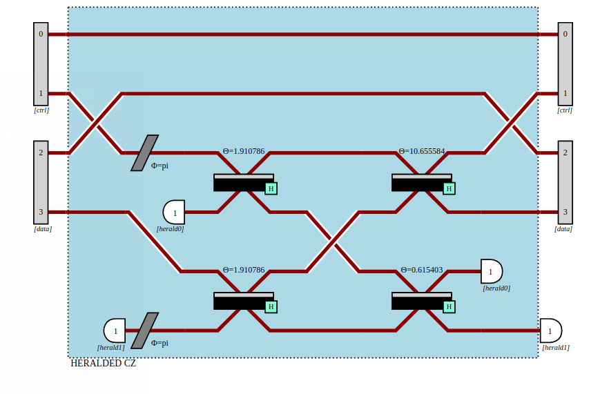
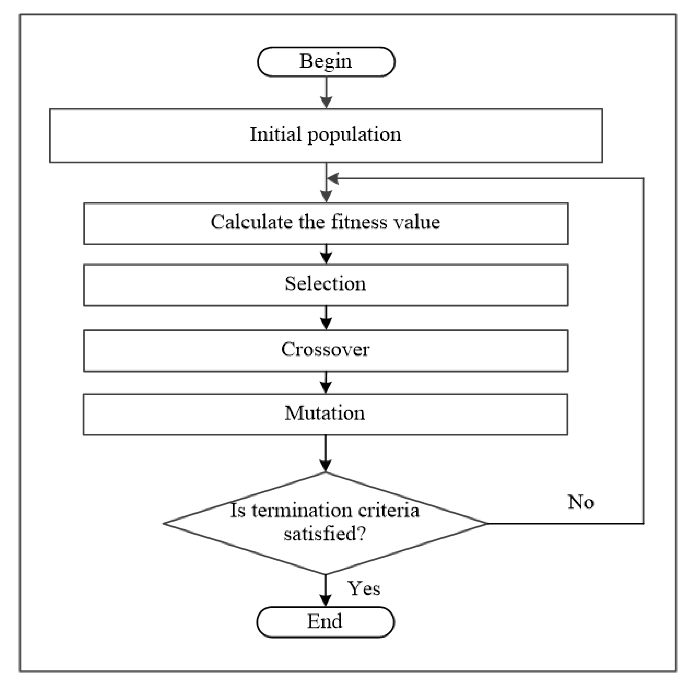

# FockCats
MIT iQuHACK 2024 - Quandela challenge

# Perceval Processor Generator

## Introduction
This script provides a Processor called `FockCats_CCZ` for quantum computing simulations.  We have also used an Advanced Optimization Algorithm called Genetic Algorithm optimize the function evaluate_matrix respect to m. Results are shown below.

## Usage
1. Install the required dependencies by running:

2. Run the script. It will define a Processor named FockCats_CCZ

4. Optionally, execute the generated processor for quantum computing simulations.

## Result
The script generates a Perceval Processor with specific configurations for quantum computing simulations.

Our optimization result seems not ideal, due to limited fidelity of ~0.99. This gives large penalties to the final performance so we decided to use the m matrix from Quandela's source code. However, Our optimization result is briefly included in thie README file, and the full process is included in our notebook.

#Jupyter Notebook is also provided that has the complete solution
2024_Quandela_Remote.ipynb is our main notebook
Bonus.ipynb is our attempt to the bonus part.

## Explanation
The provided code in `main.py` initializes a Perceval Processor with a specific quantum circuit configuration. The states and truth table are defined for the quantum algorithm analyzer. The script computes the results based on the truth table and displays the performance and fidelity of the quantum simulation.

# JupyterNotebook is also provided

# The CZ gate in reference [5] - as a warm-up to the problem


## Optimize the function evaluate_matrix to m [6].

# The CCZ gate in the Preceval library - serves as the bottom line
|   | 000 | 010 | 100 | 110 | 001 | 011 | 101 | 111 |
|---|-----|-----|-----|-----|-----|-----|-----|-----|
| 000 | 1   | 0   | 0   | 0   | 0   | 0   | 0   | 0   |
| 010 | 0   | 1   | 0   | 0   | 0   | 0   | 0   | 0   |
| 100 | 0   | 0   | 1   | 0   | 0   | 0   | 0   | 0   |
| 110 | 0   | 0   | 0   | 0   | 0   | 0   | 0   | 1   |
| 001 | 0   | 0   | 0   | 0   | 1   | 0   | 0   | 0   |
| 011 | 0   | 0   | 0   | 0   | 0   | 1   | 0   | 0   |
| 101 | 0   | 0   | 0   | 0   | 0   | 0   | 1   | 0   |
| 111 | 0   | 0   | 0   | 1   | 0   | 0   | 0   | 0   |


The Matrix Representation of Unitary is shown as :

|       |          |          |                                  |                                  |          |                                   |                                  |          |          |          |          |
|-------|----------|----------|----------------------------------|----------------------------------|----------|-----------------------------------|----------------------------------|----------|----------|----------|----------|
| 0.51  | 0        | 0        | 0                                | 0                                | 0        | 0                                 | 0                                | 0        | 0.86     | 0        | 0        |
| 0     | 0.51     | 0        | 0.32 + 0.56j                    | 0                                | 0        | 0.33 - 0.29j                     | -0.17 - 0.29j                   | -0.17 + 0.29j                   | 0        | 0        | 0        |
| 0     | 0        | 0.51     | 0                                | 0                                | 0        | 0                                 | 0                                | 0        | 0        | 0.86     | 0        |
| 0     | 0        | 0        | 0.51                             | 0                                | 0.32 + 0.56j                    | -0.17 + 0.29j                    | 0.33 - 0.29j                    | -0.17 - 0.29j                   | 0        | 0        | 0        |
| 0     | 0        | 0        | 0                                | 0.51                             | 0                                | 0                                | 0                                | 0        | 0        | 0        | 0.86     |
| 0     | 0.32 + 0.56j | 0        | 0                                | 0                                | 0.51                             | -0.17 - 0.29j                    | -0.17 + 0.29j                    | 0.33 - 0.29j                    | 0        | 0        | 0        |
| 0     | 0.33 - 0.29j | 0        | -0.17 - 0.29j                   | 0                                | -0.17 + 0.29j                   | -0.51                            | 0                                | -0.32 + 0.56j                   | 0        | 0        | 0        |
| 0     | -0.17 + 0.29j | 0        | 0.33 - 0.29j                    | 0                                | -0.17 - 0.29j                   | -0.32 + 0.56j                   | -0.51                            | 0        | 0        | 0        | 0        |
| 0     | -0.17 - 0.29j | 0        | -0.17 + 0.29j                   | 0                                | 0.33 - 0.29j                    | 0                                | -0.32 + 0.56j                   | -0.51                            | 0        | 0        | 0        |
| 0.86  | 0        | 0        | 0                                | 0                                | 0                                | 0                                | 0                                | -0.51                            | 0        | 0        | 0        |
| 0     | 0        | 0.86     | 0                                | 0                                | 0                                | 0                                | 0                                | 0                                | -0.51    | 0        | 0        |
| 0     | 0        | 0        | 0                                | 0.86                             | 0                                | 0                                | 0                                | 0                                | 0        | -0.51    | 0        |


# Optimization Algorithm: Genetic Algorithm
Genetic Optimization Algorithms are a class of evolutionary algorithms inspired by natural selection and genetics. These algorithms are used to find approximate solutions to optimization and search problems. The process is based on the principles of evolution, including selection, crossover, and mutation.

1. **Initialization:**
   - A population of potential solutions is randomly generated to represent the candidate solutions to the optimization problem.

2. **Evaluation:**
   - Each individual in the population is evaluated based on a fitness function that quantifies how well the solution solves the optimization problem. The fitness function guides the search toward better solutions.

3. **Selection:**
   - Individuals are selected from the population for reproduction based on their fitness. Solutions with higher fitness have a better chance of being selected. Common selection methods include roulette wheel selection, tournament selection, and rank-based selection.

4. **Crossover (Recombination):**
   - Pairs of selected individuals undergo crossover or recombination to create new offspring. This mimics the genetic crossover or recombination process in biology. It involves exchanging information between two parent solutions to generate one or more offspring.

5. **Mutation:**
   - Random changes, or mutations, are applied to some individuals in the population. This introduces diversity into the population and helps explore new areas of the solution space. Mutation is crucial for preventing premature convergence to suboptimal solutions.

6. **Replacement:**
   - The new offspring and some of the existing individuals from the previous generation form the next generation. The individuals with lower fitness might be replaced by the newly generated offspring.

7. **Termination:**
   - The algorithm repeats the selection, crossover, mutation, and replacement steps for multiple generations or until a termination criterion is met. Termination criteria can include reaching a specified number of generations, finding a solution with sufficient fitness, or reaching a predefined computational budget.



# Results of OPtimization using Genetic Algorithm
| Generation | Best Fitness         | Performance             | Fidelity               |
|------------|----------------------|-------------------------|------------------------|
| 1          | -5625383.713208989  | 0.02253562569531889     | 0.4374616061434754      |
| 2          | -6348300.560057424  | 0.0028710366240592075   | 0.365169941123221       |
| 3          | -6426827.478040812  | 0.003149953715482573    | 0.3573172490459652      | 
| 4          | -5577038.102341794  | 0.00686650317965945     | 0.4422961828993174      |
| 5          | -6030793.464021394  | 0.003406469234104434    | 0.39692065019139133     |
| 6          | -5854920.85362727   | 0.009930664745347387    | 0.41450790470660825     |
| 7          | -5800041.4034426315 | 0.024286240123207743    | 0.4199958353694967      |
| 8          | -4118242.5626295395 | 0.07785045022128073     | 0.5881756658865959      |
| 10         | -5069766.764668733  | 0.019138995757125923    | 0.493023304394131       |
| 11         | -4742439.575599578  | 0.019394113706626002    | 0.5257560230459285      |
| 12         |  -4383916.321959608 | 0.030845374386071274 | 0.5616083369586647 |
| 13         |   -4552959.859204714 | 0.010041634777735139 | 0.5447040040378939 |
| 14         |   -5259991.8709433805 |  0.011003369635178235 | 0.4740008019022923 |
| 15         |   -5359907.94618349 | 0.021629048799051004 | 0.46400918375260225 |
| 16         | -4444316.170467915 | 0.024055283482673415 | 0.555568358897925 |
| 17         | 3916446.847482679 | 0.01627310913761353 | 0.608355298978623 |
| 18         | -3434363.879538444 | 0.02205675296733931 | 0.6565635899894027 |
| 19         |  -4174493.9471500427 | 0.017816279935015177 | 0.5825505874687158 |
| 20         | -3725505.7449260186 | | 0.019259226810017845 | 0.6274494062481714 |
| 21         |  -3865588.602044833 | 0.060411119741218496 | 0.613441079384397 |
| 22         | -4074113.1361825434 | 0.02799334074524532 | 0.5925886583884049 |
| 23         | -3124737.021182121 | 0.044607865202171346 | 0.6875262532739227 |
| 24         | -3170155.635419304 | 0.04623846446940457 | 0.6829843902196051 |
| 25         | -3063466.2655946244 | 0.07841463265016063 | 0.6936532950259049 |
| 26         |  -3198505.701734594 | 0.18439423178219133 | 0.6801492454323088 |
| 27         |  -3095145.196158309 | 0.03581500096462681 |0.6904854445691682 |
| 28         |  -3008854.434254174 | 0.020491155804690134 | 0.6991145360834268 |
| 29         | -3035901.7673146 | 0.0219166035804126 | 0.6964098013519364 |
| 30         |   -2639228.1662403718 | 0.1130986047950075 | 0.736077070277358 |
| 31         |  -2839030.638129659 | 0.04992817982813317 | 0.7160968862588543 |
| 32         | -2745288.4984245715 | 0.18241890213984543 | 0.7254709677386407 |
| 33         |  -2757242.535626562 | 0.19546193807246706 | 0.7242755509754057 |
| 34         |  -2803012.851382805 | 0.2018194997388883 | 0.7196985130422198 |
| 35         |     -2846891.0655769124 | 0.03454488546211291 | 0.7153108588974233 |
| 36         | -2801226.764933373 | 0.04014466195501418 | 0.7198772833620007 | 
| 37         |  = -2713350.445947511 | 0.15141582475716112 | 0.7286648039894241 |
| 38 |  -2626303.470070634 | 0.030218113635072985 | 0.737369622774823 |
| 39 | -2624729.6647381126 | 0.09490246209455305 | 0.7375269386237266 |
| 40 |  -2549262.884395878 |0.1649069461855199 | 0.745073546653466 |
| 41 |  -2580619.970196302 | 0.1324864063705218 |  0.7419378704939634 |
| 42 | -2565025.7081241943 | 0.1542982403256621 | 0.7434972748893403 |
| 43 |   -2569933.5879712137 | 0.13333053230594646 | 0.7430065078723463 |
| 44 | -2568365.489558657 | 0.19965770112160133 | 0.7431632513864331 |
| 45 |  -2613902.7574920584 | 0.22972226729291773 | 0.7386094945285269 |
| 46 | -2589276.5140660782 | 0.17706052388275537 | 0.7410721715328683 |
| 47 | -2604203.739211445 | 0.10796541099704733  |0.7395795181134445 |
| 48 | -2556193.5788918305 | 0.21255673925178742 |0.7443804295540777 |
| 49 | -2554418.6085775145 | 0.19631349821641716 |0.7445579428287503 |
| 50 | -2594269.5011478523 | 0.33682185307884466 | 0.7405727130633617 |
| 51 |  -2535284.354470196 | 0.3198750810159163 | 0.7464712446778994 |
| 52 |  -2537456.1158873313 | 0.12283465819384465 |0.7462542655766087 |
| 53 | -2541479.4441161337 | 0.12463375416775545 |0.7458519309546324 |
| 54 | -2522554.626342115 | 0.32438913735077235 | 0.7477442129766512 |
| 55 | -2516570.2741823765 | 0.31759185521604016 | 0.7483426549899072 |
| 56 | -2519135.2828971623 |  0.34638588378115587 | 0.7480861253244 |
| 57 | -2547153.1483106967 | 0.18951523562840356 | 0.7452844956536947 |
| 58 | -2363254.7067114487 | 0.018138237924953015 | 0.7636745111906172 |
| 59 |   -2528197.949993535 | 0.3267992314407922 | 0.7471798782014151 |
| 60 |-2515864.260999825 | 0.2747121445912097 | 0.7484132991878729 |
| 61 |  -2523161.9949497366 | 0.33280365705002657 | 0.7476834677013693 |
| 62 |  -2498166.3912876183 | 0.020209443265371413 | 0.7501833406617949 |
| 63 |  -2517749.6070736395 | 0.2586531003480943 | 0.7482247806395357 |
| 64 | -2522499.0365897613 | 0.20036107874384237 |0.7477498959799451 |
| 65 | -2528140.3185288124 | 0.3620549009892876 |0.7471856060922177 |
| 66 | -2526722.4337988147 | 0.36403918301743676 | 0.7473273925809355 |
| 67 | -2529346.2122498555 | 0.2983237455937449 | 0.7470650804512688 |
| 68 | -2521792.447105863  | 0.2706606639534964 | 0.7478204846287497 |
| 69 | -2527061.9947144184 |0.26800632484227915 | 0.7472935325222333 |
| 70 | -2525662.285326151 | 0.4136950169296424 |0.747433357772368 |
| 71 | -2517833.7257547304 | 0.5234818343231963 | 0.7482161039426927 |
| 72 |-2521858.719399214 | 0.22654465381986413 | 0.7478139015154248 |
| 73  | -2533723.678917 |0.4345320191738495 |0.7466271975762808 |
| 74  |  -2508035.5693758084 | 0.2580367883475166 | 0.7491961850256308 |
| 75 | -2518454.68211858 | 0.2758566778419817 |0.7481542559314641 |
| 76 | -2515825.219113447 |0.2946838118979371 | 0.7484171834048434 |
| 77 | -2499619.794498745 | 0.12079152918847684 | 0.7500378997585964 |
| 78 | -2473972.2935658153 | 0.12034144195985184 | 0.7526026503019765  |
| 79  | -2515263.396200184 | 0.11811660591747046 | 0.7484735422633757 |
| 80 |  -2509246.9800874917 | 0.20231589268538636 | 0.7490750996753581 |
| 81 | -2499366.92373634 | 0.1444374431460932 | 0.7500631631889229
| 82 | -2517613.503364915 | 0.33906749996611674| Fidelity = 0.7482383105960085 |
| 83 | -2496755.5814208915 |  0.10220181824387536| Fidelity = 0.7503243396560926 |
| 84 |-2501196.3740510033 |  0.10558421197693238, Fidelity = 0.7498802570106877|
| 85 | -2467726.24637636 |  0.06814360887599022, Fidelity = 0.753227307218755 |
| 86  |-2489615.7814970855 | 0.22414738434386394| Fidelity = 0.7510381977029071 |
| 87 |  -2491445.3003304116 | 0.19301025074976383| Fidelity = 0.7508552769567081 |
| 88 | -2507638.4029873875 | 0.2149065825613714| Fidelity = 0.7492359447946787 |
| 89 | -2513146.998637004 | 0.4150214335357095| Fidelity = 0.748684885114866 |
| 90 | -2506452.8886971422 | 0.3414098456338697| Fidelity = 0.7493543697204401 |
| 91  |-2508228.3475832865 | 0.5349618615932912| Fidelity = 0.7491766302798097 |
| 92 | -2502573.5765416264 | 0.42224759867190303| Fidelity = 0.7497422200982387 |
| 93 |  -2505207.5873409836 | 0.37890930976251885| Fidelity = 0.7494788623565919 |
| 94  |  -2505000.441829067 | 0.37977829201952157| Fidelity = 0.7494995760388012 |
| 95  | -2507821.8486811933 | 0.44463135771846746| Fidelity = 0.749217370500523  |
| 96 |-2506662.1239400054 | 0.41815815199419215| Fidelity = 0.7493333694478475 |
| 97 | -2506217.533450178 | 0.4191008945687026| Fidelity = 0.7493778275540877 |
| 98 |-2504874.2612465983 | 0.4238279330336011| Fidelity = 0.7495121500474071 |
| 99 |  -2506828.0911868387 | 0.3340164100482485|  Fidelity = 0.7493168568649061 |
| 100 |-2506523.3244959335 | 0.5116670737683715| Fidelity = 0.7493471558833329 |
| 101 |-2503597.0274902103 | 0.46116487155082303| Fidelity = 0.7496398360861074 |
| 102 | -2502546.1943593435 | 0.3736220663227922| Fidelity = 0.7497450069419993 |
| 103 | -2505301.8690779563 | 0.5043493611285196| Fidelity = 0.7494693087428432 |
| 104 |-2505372.7308448763 | 0.3095623958099052| Fidelity = 0.7494624173531166 |
| 105 | -2458929.680757169 |  0.06809476547974587| Fidelity = 0.7541069638295176 |
| 106 |-2443821.6894593528 |  0.058886398925219595| Fidelity = 0.7556177721676658 |
| 107 | -2495201.2661511395 |  0.11983194253634004| Fidelity = 0.7504797535529435 |
| 108 |-2490581.7963504153 |  0.1590099716938641| Fidelity = 0.7509416613549867  |
| 109 | -2409320.9117336073 |  0.05409725761036321 Fidelity = 0.7590678547293817 |
| 110 | -2349095.176754944| 0.042367373285582884| Fidelity = 0.7650904399571323 | 
| 111 |  -2487018.6628529574|  0.13015324420516697| Fidelity = 0.75129800356146 |
| 112 | -2485356.8356598397 | 0.1277516937960262| Fidelity = 0.7514641886823222 |
| 113 |-2505443.0227887565 | 0.37262367607234115| Fidelity = 0.7494553250974483 | 
| 114 |-2503449.4128679796 |0.6155470790605322| Fidelity = 0.749654443166123 |
| 115 | -2503430.753762313 |0.3929266691148112| Fidelity = 0.7496565316970996 |
| 116 | -2499270.490092388 |  0.34202003773555134| Fidelity = 0.7500726089707235 |
| 117 |-2497104.48338066 |  0.2946526974384231| Fidelity = 0.7502892570092365 |
| 118 | -2500389.2217304106 |  0.29118731122861263| Fidelity = 0.7499607866396477 |
| 119 |-2504047.8142257007 |  0.14173188943490828| Fidelity = 0.7495950768455405 |
| 120 |-2504681.8438742366 |  0.28535408749273944| Fidelity = 0.7495315302584888
| 121 |  -2501962.7050261158 |  0.32855326549690983| Fidelity = 0.7498034009441229 |
| 122 | -2502232.66639753 | 0.32165346278302076| Fidelity = 0.7497764117067842 |
| 123 | -2502260.9830597807 |  0.33972427205003475| Fidelity = 0.7497735619697499 |
| 124 |-2505787.978722989 |  0.41253170586544297| Fidelity = 0.7494207895959952 |
| 125 | -2501054.3586296802 | 0.2392295374457909| Fidelity = 0.7498943249074945 |
| 126 | -2494374.9585014223 |  0.21629096266347095| Fidelity = 0.7505622878588951 |
| 127 | -2504147.000592623 | 0.39885183393785095| Fidelity = 0.7495849010889037 |
| 128 | -2505109.02570499 |  0.20455255046202314| Fidelity = 0.7494888928769505 |
| 129 | -2504934.268106428 |  0.47044087616592134| Fidelity = 0.7495061027484811 |
| 130 |-2504120.001795615 |  0.22055181682370495| Fidelity = 0.7495877792686216 |
| 131 | -2491817.319906784 |  0.04963552003290547| Fidelity = 0.7508182183738016 | 
| 132 | -2476062.6537108067 |  0.03488700756926028| Fidelity = 0.7523936997419117 |
| 133 | -2506193.087566307 |  0.3086784207586247| Fidelity = 0.7493803825649485 |
| 134 | -2505431.53918798 |  0.6001220859192812| Fidelity = 0.7494562459591161 | 
| 135 |-2502446.5713282675 |  0.41027757710955676| Fidelity = 0.7497549325895961 |
| 136 |-2505251.4868725813 |  0.36488167226758506| Fidelity = 0.7494744864310696 |
| 137 | -2505199.560471747 | 0.24708879118106128| Fidelity = 0.7494797968640341 |
| 138 | -2479757.38763929 |0.10861495544265103| Fidelity = 0.7520241526211155 |
| 139 | -2459821.6856805286 |  0.12122913331204208| Fidelity = 0.7540177102028138 |
| 140 | -2474908.401206286 | 0.20634967377770094| Fidelity = 0.7525089535296976 |
| 141 | -2456600.642107413 |  0.14108231677287336| Fidelity = 0.7543397947069419  |
| 142 |-2485316.0726546436 | 0.19717635595413618| Fidelity = 0.7514681955581797 |
| 143 | -2488811.0202909755 |  0.20696947156598755| Fidelity = 0.7511186910014309 |
| 144 | -2471873.901908092 | 0.09251553262798397| Fidelity = 0.7528125172936582 |
| 145 |-2463302.7369964994 |  0.17580376737832026| Fidelity = 0.7536695504965827 |
| 146 | -2449169.7359164567 |0.16329190222174617| Fidelity = 0.7550828631164521 |
| 147 |  -2447487.3093316546 | 0.15057884991545098| Fidelity = 0.7552511184879847 |
| 150 | -2405008.375915959 | 0.09359726986856429| Fidelity = 0.7594990688111343 |
| 151 |-2317176.940021863 | 0.05333569808809937| Fidelity = 0.7682822526621156 |
| 152 |-2298400.803429333 |0.041797936271479735| Fidelity = 0.7701598778591304 |
| 153 |  -2252492.4997259816 |  0.041781510299979445| Fidelity = 0.7747507082458915 |
| 154 | -2248795.56233844 | 0.04131047226520309| Fidelity = 0.7751204024556837 |
| 155 |  -2200847.352835093 | 0.05635223650737966| Fidelity = 0.7799152083642542 |
| 156 | -2092143.91824686 | 0.01950353070961284| Fidelity = 0.7907855886717833 |
| 157 |-2058129.0057438028 |  0.020489373542404314| Fidelity = 0.7941870789362462 |
| 158 | -2051168.503947513 | 0.014438561745951728| Fidelity = 0.794883135166687 |
| 159 |  -1664525.3610853974 | Performance = 0.016913420520551805| Fidelity = 0.8335474469780397  |
| 160 |  -1867831.6529369284 | Performance = 0.010203158909820584| Fidelity = 0.8132168245031483 |
| 161 |  -1751525.0144619145 | Performance = 0.003935036496731593|Fidelity = 0.824847494618772 |
| 162 |   -1746634.8843294755 | Performance = 0.006719732890815303| Fidelity = 0.8253365048473196 |
| 163 |   -1690039.9095170682 | Performance = 0.013976742968938857| Fidelity = 0.8309959950715502 |
| 164 | -1295089.2405216873, | Performance = 0.006444466976729435| Fidelity = 0.8704910695033643 |
| 165 |   -1444453.698632703 | Performance = 0.02791845899147083| Fidelity = 0.8555546022182707 |
| 166 |  -1203991.0903236468 | Performance = 0.012384599059353176| Fidelity = 0.8796008785830363 |
| 167 | -1078993.9445070561 | Performance = 0.004887977584638763| Fidelity = 0.8921006006613168 |
| 168 | -1250428.7936216395 | Performance = 0.009537519354678552| Fidelity = 0.8749571111003167 |
| 168 | -819118.0714487002 | Performance = 0.008601830011502467| Fidelity = 0.9180881842533 |
| 169 |    -645930.4368699933 | Performance = 0.002294989785241569| Fidelity = 0.9354069540180109 |
| 170 |  -523823.91407183424 | Performance = 0.0021582515241658894| Fidelity = 0.947617606434565 |
| 171 | -903746.3145723669 |Performance = 0.005956061966436127| Fidelity = 0.9096253625867013 |
| 172 | -699580.6117414457 | Performance = 0.021459126168468106| Fidelity = 0.9300419173667293 |
| 173 | -635169.6656139133 | Performance = 0.01775170926891931| Fidelity = 0.9364830156868994 |
| 174 | -507001.6457165511 | Performance = 0.012255074891836987| Fidelity = 0.94929982317327 |
| 175 |   -674031.5001850429| Performance = 0.016357142846013018| Fidelity = 0.9325968336243529 |
| 176 |    -586562.2589100626| Performance = 0.016088232320644675| Fidelity = 0.9413437580207614 |
| 177 |    -607763.1966200628 |  Performance = 0.005653818600974784| Fidelity = 0.9392236746841751 |
| 178 |   -525149.7083605621 | Performance = 0.01006640688641232| Fidelity = 0.9474850190975369 |
| 179 |  -636354.4003607928 | Performance = 0.018336117358402695| Fidelity = 0.9363645416278034 |
| 180 |  -606165.7481705195 | Performance = 0.013314902964971953| Fidelity = 0.9393834118680451 |
| 181  | -617285.1782105254 | Performance = 0.003283578909043374| Fidelity = 0.9382714788953685 |
| 182  |    -473998.41822291433 | Performance = 0.007148445689378141| Fidelity = 0.9526001510292629 |
| 183  |   -500977.24472207995 | Performance = 0.011107413942387562| Fidelity = 0.9499022644203781 |
| 184  |   -482004.0290859024 | Performance = 0.011657279746366262| Fidelity = 0.95179958543413 |
| 185  | -365368.7250145294 |Performance = 0.0033555100278584585| Fidelity = 0.963463124143037 |
| 186  |    -321128.8107751497 | Performance = 0.003396903098688637| Fidelity = 0.9678871155255819 |
| 187  |    -319620.5017474025 | Performance = 0.003343165353834905| Fidelity = 0.9680379464820944 |
| 188  |    -314171.17834070476 |Performance = 0.0027445000119867974| Fidelity = 0.9685828794214295 |
| 189  |     -287574.81741468067 | Performance = 0.00831400516942633| Fidelity = 0.9712425099445268 |
| 190  |   -181645.47706191233 |Performance = 0.012149532394278973| Fidelity = 0.9818354401442764 |
| 191  | -199043.9656570803 | Performance = 0.008267014569904266| Fidelity = 0.9800955951672774 |
| 192  |   -214603.12760705253 | Performance = 0.0070002030885160955| Fidelity = 0.9785396802390917 |
| 193  | -199130.5511395259 | Performance = 0.016027555277251398| Fidelity = 0.9800869288584921 |
| 194  |  = -235578.1209885498 | Performance = 0.006395421313347806| Fidelity = 0.9764421815057237 |
| 195  |  = -176077.8604552065 | Performance = 0.002837219744919903| Fidelity = 0.9823922111172596 |
| 196  |  = -210261.50312165247 | Performance = 0.007556245309837289| Fidelity = 0.9789738421315894 |
| 197  | = -179011.90120674623 | Performance = 0.009001246271939179| Fidelity = 0.9820988008780791 |
| 198  |  -147157.95191593896 | Performance = 0.004046704570810863| Fidelity = 0.9852842007617015 |
| 199  |  -157716.83043616856 | Performance = 0.0073663083540582985| Fidelity = 0.9842283095900748 |
| 200  | -230478.2961753149 | Performance = 0.006919734228478332| Fidelity = 0.9769521634627343 |
| 201 | -225648.98844958189 | Performance = 0.012078127361865431| Fidelity = 0.9774350890769145 |
| 202 |-225325.26088520966  | Performance = 0.006744447668074117| Fidelity = 0.9774674671670314 |
| 203 | -168447.45494446647 | Performance = 0.005919356946483615| Fidelity = 0.9831552485861964 |
| 204 | -155397.8881250593 | Performance = 0.00894481746060827| Fidelity = 0.9844602022426766 |
| 205 | -185008.52297469112 | Performance = 0.013899439380251347| Fidelity = 0.9814991338030915 | 
| 206 | -259219.0810162182 | Performance = 0.013220372735430449| Fidelity = 0.9740780786780054 |
| 207 | -257587.51405057628 | Performance = 0.012044144730126084| Fidelity = 0.9742412365507976  |
| 208 | -235336.17023401294 |Performance = 0.019569752145317032| Fidelity = 0.9764663634068466 |
| 209 | -199810.67494803198 |Performance = 0.029100408657511748| Fidelity = 0.9800189034047881|
| 210 | -219942.50328716828 |Performance = 0.02987058966413623| Fidelity = 0.9780057198006935 | 
| 211 | -165861.3629763888 |P erformance = 0.007620320769950638| Fidelity = 0.9834138560820403 |
| 212 | -185639.51189892215 | Performance = 0.02971560383110391| Fidelity = 0.981436019094504 |
| 213 | -158574.30880233186| Performance = 0.02461954505454423| Fidelity = 0.9841425445002218 |
| 214 | -175478.59655906056| Performance = 0.023324460078852888| Fidelity = 0.9824521170196339 |
| 215 | -171419.77100279662| Performance = 0.022339961088981536| Fidelity = 0.9828580005597592 |
| 216 | -177149.9788402103| Performance = 0.01687848777810386| Fidelity = 0.9822849852374912 |
| 217 | -166448.24898494| Performance = 0.015637391441191036| Fidelity = 0.9833551594641146 |
| 218 | -221810.36112719547| Performance = 0.01238476626563857| Fidelity = 0.9778189515025142 |
| 219 | -221832.0775082301| Performance = 0.012387382384523792| Fidelity = 0.9778167798617946 |
| 220 |  -171359.0446925365| Performance = 0.020947033630784956| Fidelity = 0.9828640745837127 |
| 221 | -201767.35221030793| Performance = 0.00959709668548396| Fidelity = 0.9798232551818725 |
| 222 | -168662.8965960185| Performance = 0.003247266513274938| Fidelity = 0.9831337070931316 |
| 223 | -176357.09039995985| Performance = 0.01937530127324053| Fidelity = 0.9823642715847027 |
| 224 | -193540.03001351963| Performance = 0.014313084015887044| Fidelity = 0.980645982685564 |
| 225 | -198379.8853160845| Performance = 0.02497370932556034| Fidelity = 0.9801619864946822 |
| 226 | -160788.2170595078| Performance = 0.015019881765041184| Fidelity = 0.9839211632741675 |
| 227 | -179664.97089306833| Performance = 0.01535190611311733| Fidelity = 0.982033487558787 |
| 228 | -210984.88657431| Performance = 0.025610700477849687| Fidelity = 0.9789014857318685 |
| 229 | -201496.6973270896| Performance = 0.025162291883731213| Fidelity = 0.9798503051049992 |
| 230 | -231106.2979618741| Performance = 0.019691964034818175| Fidelity = 0.9768893505118486 |
| 231 |  -153778.90015265174| Performance = 0.021407083614434764| Fidelity = 0.9846220885776512 |
| 232 | -153410.6303176138| Performance = 0.02140975023024603| Fidelity = 0.9846589155584884 |
| 233 | -153027.00940400967| Performance = 0.01894455383020556| Fidelity = 0.9846972801150452  |
| 234 |-167980.58265147207| Performance = 0.01749876269472507| Fidelity = 0.9832019242360901 |
| 235 |-198808.98558883477| Performance = 0.017524445727241694| Fidelity = 0.9801190839166708 |
| 236 |-184061.36033209495| Performance = 0.016511927949139537| Fidelity = 0.9815938474548626 |
| 237 |177388.21116972098| Performance = 0.014902123553944692| Fidelity = 0.9822611639809044 |
| 238 |-157037.39954965754| Performance = 0.01902422643117911| Fidelity = 0.9842962410208078 |
| 239 | -194380.32853025338| Performance = 0.0179575867810117| Fidelity = 0.9805619491893879 |
| 240 | -209779.2635329612| Performance = 0.01434559734954331| Fidelity = 0.9790220593011065 |
| 241 |-183160.90678246567| Performance = 0.008353824420315013| Fidelity = 0.981683900967929 |
| 242 | -147401.01657917362| Performance = 0.012632006691664682| Fidelity = 0.9852598857100759 |
| 243 |149396.14998644785| Performance = 0.0076510891339741476| Fidelity = 0.9850603773502661 |
| 244 | -198427.10359468844| Performance = 0.01203474729596844| Fidelity = 0.9801572776057839 |
| 245 |-134295.53743373347| Performance = 0.006062764123359896| Fidelity = 0.9865704401938625 |
| 246 | -186032.96691535055| Performance = 0.02219459914628519| Fidelity = 0.9813966811138658 |
| 247 | -178960.00816783597| Performance = 0.009861588389763897| Fidelity = 0.982103989321628 |
| 248 | -194498.6642768857| Performance = 0.016985333544637115| Fidelity = 0.9805501165869779 |
| 249 |-209691.84476237727| Performance = 0.01755754754730068| Fidelity = 0.9790307979662147 |
| 250 |  -236202.86057572011| Performance = 0.009051539888270383| Fidelity = 0.9763797048908881 |
| 251 | -203239.2464155443| Performance = 0.023100174425514593| Fidelity = 0.9796760522582711 |
| 252 |-199937.271632766| Performance = 0.015801828986656878| Fidelity = 0.9800062570348944 |
| 253 | -148541.5518204078| Performance = 0.014036694170303458| Fidelity = 0.985145830781265 |
| 254 |-147012.81764973208| Performance = 0.025022059088286128| Fidelity = 0.9852986932129677 |
| 255 | -147859.02477516048| Performance = 0.023962291646542327| Fidelity = 0.9852140735601923 |
| 256 | -136330.65953723429| Performance = 0.019172707925822333| Fidelity = 0.9863669148735686 |
| 257 | -123412.08786029514| Performance = 0.018387280140187368| Fidelity = 0.9876587728266903 |
| 258 | -154159.01599094374| Performance = 0.02371756387753439| Fidelity = 0.9845840746833417 |
| 259 | -154289.9498783676| Performance = 0.018891609082981785| Fidelity = 0.9845709861205542 |
| 260 |-107113.40220951349| Performance = 0.026319954859785735| Fidelity = 0.9892886334590938 |
| 261 |-144391.68748381943| Performance = 0.019435487968041173| Fidelity = 0.9855608118161301 |
| 262 | -115803.06896837585| Performance = 0.024553900638482173| Fidelity = 0.9884196685492618 |
| 263 | -108540.52845330411| Performance = 0.01516901999336416| Fidelity = 0.9891459319856496 |
| 264 | -124027.41949995347| Performance = 0.017727760046243712| Fidelity = 0.9875972403222446 |
| 265 |-123237.15465789821| Performance = 0.017650899396246922| Fidelity = 0.9876762668833108 |
| 266 | -103495.33024188816| Performance = 0.015373987440167906| Fidelity = 0.9896504516018237 |
| 267 | -103889.5782515047|  Performance = 0.015479936675144653| Fidelity = 0.9896110266949129 |
| 268 |   -123007.4950015765| Performance = 0.019173870755701386| Fidelity = 0.9876992313259716 |
| 269 |-124676.0357771896| Performance = 0.021044174144257712| Fidelity = 0.9875323753781069 |
| 270 |110141.3808716998| Performance = 0.01964689612940247| Fidelity = 0.9889858422659339 |
| 271 |-109998.09716034685| Performance = 0.019729224216659205| Fidelity = 0.9890001705547411 |
| 272 | -106149.33188868618| Performance = 0.020653203720291537| Fidelity = 0.9893850461579277 |
| 273  |-103858.1187557326| Performance = 0.02164238070901734| Fidelity = 0.989614166482046 |
| 274  | -120089.71887806356| Performance = 0.021721803807967316| Fidelity = 0.9879910063903898 | 
| 275 |-109552.29383733815| Performance = 0.012362463960212376| Fidelity = 0.9890447582538022 |
| 276 | -137500.5656595493| Performance = 0.022360900940060636| Fidelity = 0.9862499210731441 |
| 277 |-131002.68500721209| Performance = 0.02599534565886575| Fidelity = 0.9868997055039331 |
| 278 |-172038.56226004518| Performance = 0.025419525365346366| Fidelity = 0.9827961183544701 |
| 279 | -143839.62140141288| Performance = 0.030633238582791517| Fidelity = 0.9856160072266201 |
| 280 | -139561.3993963836| Performance = 0.029460998349289908| Fidelity = 0.9860438305993633 |
| 281 |-136807.24455980625| Performance = 0.029848436994652675| Fidelity = 0.9863192456955824  |
| 282 |  -130532.94315136923| Performance = 0.0227005220051289| Fidelity = 0.9869466829843411 |
| 283 | -160129.94482488002| Performance = 0.023698593249455484| Fidelity = 0.9839869818189187 |
| 284 | -132121.57274445306| Performance = 0.03176328427495581| Fidelity = 0.9867878109622704 |
| 285 |-108159.1252454149| Performance = 0.017947621180242054| Fidelity = 0.9891840695278373 |
| 286 |-136990.3349669693| Performance = 0.025229219883825236| Fidelity = 0.9863009412740832 | 
| 287 |-129167.32377242012| Performance = 0.02089749716670846| Fidelity = 0.9870832467252608 |
| 288 | -134589.8523958661| Performance = 0.015064661015123328| Fidelity = 0.9865409996957524 |
| 289 | -119058.46550825845| Performance = 0.015412031077624535| Fidelity = 0.9880941380371431 |
| 290 |-123268.52086391526| Performance = 0.014006299987107496| Fidelity = 0.9876731339073085 |
| 291 |-121019.46748965797| Performance = 0.014084624699171489| Fidelity = 0.9878980391664095 |
| 292 | -95349.21749278036| Performance = 0.021312394426143088| Fidelity = 0.9904650569383275 |
| 293 | -109579.59145023124| Performance = 0.02355869271767229| Fidelity = 0.9890420172962842 |
| 294 | -127568.22106340839| Performance = 0.029594522653447034| Fidelity = 0.9872431482991365 |
| 295 | -114872.58540613117| Performance = 0.010241398444840977| Fidelity = 0.9885127312179884 |
| 296 |103603.37613859553| Performance = 0.016206426330155958| Fidelity = 0.9896396461797141  |
| 297 | -87495.49586386609| Performance = 0.016552453428879933| Fidelity = 0.99125043386116 |
| 298 | -114095.1393682059| Performance = 0.009640299294432856| Fidelity = 0.9885904764228801 |
| 299 | -121104.02980150045| Performance = 0.019979136614824672| Fidelity = 0.9878895770407133  |
| 300 | -88607.7552786313| Performance = 0.008230867876170425| Fidelity = 0.991139216241269 |
| 301 | -113641.67453639714| Performance = 0.02554173434139032| Fidelity = 0.9886358070046259 |
| 302 | -103664.22345290617| Performance = 0.029459063410287305| Fidelity = 0.989633548195646 |
| 303 | -101441.39838356778| Performance = 0.02887832389043826| Fidelity = 0.9898558312833193 |
| 304 | -124611.04897975097| Performance = 0.030548740580509035| Fidelity = 0.9875388645532843 |
| 305 | -107166.33066520798| Performance = 0.01200545509591436| Fidelity = 0.9892833549280241 |
| 306 | -93202.347114457| Performance = 0.01157391850915562| Fidelity = 0.9906797537146358 |
| 307 | -109646.39477302517 | Performance = 0.015378775487870085| Fidelity = 0.989035345143922 | 
| 308 |-144275.22805490805| Performance = 0.02724159582094895| Fidelity = 0.9855724499529134| 
| 309 | -86883.90791953498| Performance = 0.02760790251458222| Fidelity = 0.991311581600144 |
| 310 | -114276.42008113662| Performance = 0.022531502194132358| Fidelity = 0.9885723354603841 | 
| 311 | -101732.29401855209| Performance = 0.017208923800275173| Fidelity = 0.989826753389221|
| 312 | -101758.73567290709| Performance = 0.016065492555133322| Fidelity = 0.9898241103672167 |
| 313 | -98814.76833325379| Performance = 0.01977236744058588| Fidelity = 0.9901185033943072 |
| 314 | -93743.501309801| Performance = 0.010552228637717216| Fidelity = 0.9906256393167913 |
| 315 | -124773.99204767027| Performance = 0.01886828166863422| Fidelity = 0.9875225819269513 |
| 316 | -78768.58031423019| Performance = 0.013552922559988566| Fidelity = 0.9921231284156544 |
| 317 | -78358.38855289623| Performance = 0.013171352765067595| Fidelity = 0.9921641479733576 |
| 318 | -102043.63284630261| Performance = 0.012843605286921717| Fidelity = 0.9897956238717645 |
| 319 | -86976.50828399757| Performance = 0.013015833338320721| Fidelity = 0.9913023361557669 |
| 320 | -63449.07823289351| Performance = 0.013541232787112488| Fidelity = 0.9936550786354779 |
| 321 | -101690.22433198821| Performance = 0.020431137797559704| Fidelity = 0.9898309571356634 |
| 322 | -126430.33530208032| Performance = 0.019753757168460524| Fidelity = 0.9873569467160348 |
| 323 | -100406.48297600892| Performance = 0.021635491824443853| Fidelity = 0.9899593300669073 |
| 324 | -99671.25106441193| Performance = 0.021640234898648573| Fidelity = 0.990032853253323|  
| 325 | -99265.55396502522| Performance = 0.018860365193070425| Fidelity = 0.9900734257431323 |
| 326 | -87464.80760534055| Performance = 0.01743975855151932| Fidelity = 0.9912535017997074 |
| 327 | -105962.46388694963| Performance = 0.007909586518577637| Fidelity = 0.9894037457017185 |
| 328 | -111373.91528318128| Performance = 0.02082450393510308| Fidelity = 0.9888625876471779 |
| 329 | -108924.90453782135| Performance = 0.018075337247273452| Fidelity = 0.9891074914708806 |
| 330 | -106173.91018876637| Performance = 0.02568943687206721| Fidelity = 0.9893825832916865 |
| 331 | -84674.57059148802| Performance = 0.026136602165533564| Fidelity = 0.991532516804249 |
| 332 | -111750.8756060774| Performance = 0.03193722127040027| Fidelity = 0.988824880502171 |
| 333 | -91716.47624743474| Performance = 0.02490502421937358| Fidelity = 0.9908283274702323 |
| 334 | -82968.91975010229| Performance = 0.019248529808520078| Fidelity = 0.99170308877646 |
| 335 | -92188.84700092381| Performance = 0.025259284305357496| Fidelity = 0.9907810900406233 |
| 336 | -87041.14082961365| Performance = 0.03321787498604686| Fidelity = 0.9912958526991636 |
| 337 |   -104224.83292368673| Performance = 0.01929439535314098| Fidelity = 0.989577497413236 |
| 336 | -86433.49449975962| Performance = 0.018002524422616163| Fidelity = 0.9913566325474996 |
| 339 | -59744.289362269155| Performance = 0.014262214954263991| Fidelity = 0.9940255568015581 |
| 340 | -49481.14338132299| Performance = 0.014457640589442192| Fidelity = 0.9950518712042271  |
| 341 |  -64542.19392443842| Performance = 0.01586716391241292| Fidelity = 0.9935457647403922 |
| 342 | -48548.41865923589| Performance = 0.015552022411797971| Fidelity = 0.995145142582054 |
| 343 | -101380.53316719165| Performance = 0.020390640475517485| Fidelity = 0.9898619262926404 |
| 344 | -85679.05196150826| Performance = 0.02027699062063279| Fidelity = 0.9914320745268586 |
| 345 | -93900.71823336776| Performance = 0.019291498132948642| Fidelity = 0.9906099088851651 |
| 346 | -95443.42293002014| Performance = 0.0205597311769333| Fidelity = 0.9904556371472668 |
| 347 | -77365.69547743653| Performance = 0.01420230117090121| Fidelity = 0.9922634162499552 |
| 348 | -91623.23999901315| Performance = 0.02732285923916613| Fidelity = 0.9908376486772394 |
| 349 | -108743.87288397682| Performance = 0.02529433512539707| Fidelity = 0.9891255874172672 |
| 350 | -99249.60573010046| Performance = 0.027235735466029122| Fidelity = 0.9900750121912545 |
| 351 | -101932.10232393348| Performance = 0.02291694727168725| Fidelity = 0.9898067668506594 |
| 352 |  -101452.95942938095| Performance = 0.027855462845633595| Fidelity = 0.9898546762015991 |
| 353 | -90965.37471270589| Performance = 0.02923710507479629| Fidelity = 0.9909034332916243 |
| 354 | -84213.41020458737| Performance = 0.025505708358199323| Fidelity = 0.9915786334738329 | 
| 355 | -108757.9290601096| Performance = 0.019644650539856007| Fidelity = 0.9891241874493385 |
| 356 | -100719.01068248737| Performance = 0.024468306156470783| Fidelity = 0.9899280744634451 |
| 357 | -83581.46893913217| Performance = 0.028667023215041897| Fidelity = 0.9916418244390636 |
| 358 |- 89849.51254696706| Performance = 0.022884697991506095| Fidelity = 0.9910150258606053  |
| 359 | -105827.19014976331| Performance = 0.02536518238464335| Fidelity = 0.9894172556198413 |
| 360 | -126866.57641812364| Performance = 0.018276688115151346| Fidelity = 0.9873133240814995 |
| 361 | -113824.68599248328| Performance = 0.02496970149649004| Fidelity = 0.9886175064310502 |
| 362 | -98081.8539028259| Performance = 0.025537547650535185| Fidelity = 0.9901917890721698 |
| 363 | -106496.24925255311| Performance = 0.03234810577948402| Fidelity = 0.9893503427266389  |
| 364 |  -84644.72829342149| Performance = 0.025582579390720762| Fidelity = 0.9915355015880785 |
| 365 |-87108.09765295731| Performance = 0.01418248493506457| Fidelity = 0.9912891760522193 |
| 366 |   -80100.31493299472| Performance = 0.02966798608040526| Fidelity = 0.991989938838714 |
| 367| -88557.36716416714| Performance = 0.028405532919488965| Fidelity = 0.9911442348780504 |
| 368 |  -70347.01419315484| Performance = 0.02512320575726267| Fidelity = 0.9929652734574788 |
| 369 | -78265.85517601225| Performance = 0.025007101789584908| Fidelity = 0.992173389475297 |
| 370 | -65329.46589354321| Performance = 0.01993366206066223| Fidelity = 0.9934670334769836 |
| 371  |-77107.739793692| Performance = 0.022703745495487013| Fidelity = 0.9922892033168853 |
| 372  |-61227.63294224421| Performance = 0.023925861436121392| Fidelity = 0.9938772127799141 |
| 373  |   -73317.64791530746| Performance = 0.015202428318157813| Fidelity = 0.9926682200060409 |
| 374  | -55689.95754451337| Performance = 0.016329578819855934| Fidelity = 0.9944309879159698 |
| 375 | -60196.311790904954| Performance = 0.022891105283637962| Fidelity = 0.9939803459298042 |
| 376 | -58155.29963466432| Performance = 0.022320126440712282| Fidelity = 0.9941844477164071 |
| 377 |-67877.74333569975| Performance = 0.023605486064023195| Fidelity = 0.993212202060944 |
| 378  |-48819.42706649201| Performance = 0.021379167890945773| Fidelity = 0.9951180359141829 |
| 379 | -48819.42706649201| Performance = 0.021379167890945773| Fidelity = 0.9951180359141829 |
| 380  |-57241.83574069215| Performance = 0.021367339579442753| Fidelity = 0.9942757950585912 |
| 381  | -54175.08967227385| Performance = 0.02044395395836239| Fidelity = 0.9945824705888187 |
| 382 |-55243.51395174963| Performance = 0.02062997391994455| Fidelity = 0.9944756279748511 |
| 383 |-75026.18811886357| Performance = 0.01798640719275352|  Fidelity = 0.9924973632017065 |
| 384 |  -65219.197722992525| Performance = 0.01877490914180719| Fidelity = 0.9934780614527916 |
| 385 |-68333.03409493974 | Performance = 0.019384407500896417| Fidelity = 0.9931666772060985 |
| 386 |-55812.117311640686| Performance = 0.016897595691292105| Fidelity = 0.9944187713712402 |
| 387 |-70877.76945932987| Performance = 0.01999998578133972| Fidelity = 0.9929122030540812 | 
| 388 | -70230.48793721659| Performance = 0.021829640612810893| Fidelity = 0.9929769293766377 |
| 389 |-73129.85399540619| Performance = 0.019348430079680214| Fidelity = 0.9926869952520293 |
| 390 | -65138.79236991846| Performance = 0.012120804273592058| Fidelity = 0.9934861086422039 |
| 391 |-62261.838626971556| Performance = 0.012136130632556872| Fidelity = 0.9937738040011722 |
| 392 | -63023.11010230443| Performance = 0.011878407857906493| Fidelity = 0.9936976771113617 |
| 393 | -59737.37932371801| Performance = 0.01344354413607461| Fidelity = 0.9940262486240841 |
| 394 |-51389.01573777299| Performance = 0.014823948490900794| Fidelity = 0.9948610836022742 |
| 395 | -81356.75416118918| Performance = 0.01572678843484798| Fidelity = 0.9918643088570926  |
| 396 |-78312.80279123005| Performance = 0.02979465767943424| Fidelity = 0.9921686899262193 |
| 397 |-73450.53419303271| Performance = 0.027069612529641605| Fidelity = 0.9926549195110842 |
| 398 | -82271.26029282424| Performance = 0.019430400636942867| Fidelity = 0.9917728545403169 |
| 399 |-95962.52941315391| Performance = 0.0233515334794301| Fidelity = 0.9904037237071511 |
| 400 |-69539.25630146789| Performance = 0.019429007908353613| Fidelity = 0.9930460549408453 |
| 401 |-78765.8410815368| Performance = 0.02242803370022169| Fidelity = 0.9921233934638126 |
| 402 |-86823.75299676285| Performance = 0.02554681790156351| Fidelity = 0.9913175991535058 |
| 403 |  -84573.3809896169| Performance = 0.016712868497539436| Fidelity = 0.9915426451881698 |
| 404 |-70566.34935431363| Performance = 0.012779402467588484| Fidelity = 0.9929433522851662 |
| 405 | -68620.80662414295| Performance = 0.024007202157826694| Fidelity = 0.9931378953303835 |
| 406 | -68620.80662414295| Performance = 0.024007202157826694| Fidelity = 0.9931378953303835 |
| 407 |-87626.77697011294| Performance = 0.02333670749503997| Fidelity = 0.9912372989662812 |
| 408 | -72467.90478044437| Performance = 0.023303960874213322| Fidelity = 0.9927531862179947 |
| 409 |-73095.1163528677| Performance = 0.020877245753823943| Fidelity = 0.9926904674874675 |
| 410 |-89322.36948969189| Performance = 0.015714068131932754| Fidelity = 0.9910677473369627 |
| 411 |  -85667.50740563516| Performance = 0.02239599766327956| Fidelity = 0.9914332268634388 |
| 412 |-82357.61337782285| Performance = 0.0242132498190759| Fidelity = 0.9917642144489679 |
| 413 | -87389.3883248352| Performance = 0.018804831837229745| Fidelity = 0.9912610423626846 |
| 414 | -74159.15571176544| Performance = 0.02201510912555417| Fidelity = 0.9925840624137143 |
| 415  | -68333.82196834311| Performance = 0.021716878143949025| Fidelity = 0.9931665960862875 |
| 416  | -72921.71173244376| Performance = 0.018931760771124| Fidelity = 0.9927078098949949 |
| 417 | -62023.82138950943| Performance = 0.025962613639159728| Fidelity = 0.9937975918984354 |
| 418|   -71045.62884759478| Performance = 0.018860146768094086| Fidelity = 0.9928954182550938 |
| 419 | -80487.75151570342| Performance = 0.018046372039796307| Fidelity = 0.9919512068020576 |
| 420 |-83046.42670692058| Performance = 0.018614190217993525| Fidelity = 0.9916953387151177 |
| 421 |-92389.4018912035| Performance = 0.030667192850407376| Fidelity = 0.9907610291436868 |
| 422 |-93379.82987690374| Performance = 0.020204641538145367| Fidelity = 0.9906619968076681|
| 423 | -101594.15744679101| Performance = 0.03647760010779904| Fidelity = 0.9898405477777208 |
| 424 |-98217.83242457468| Performance = 0.019685022560328613| Fidelity = 0.99017819707252 |
| 425 |-81700.72329844939| Performance = 0.027475340853367385| Fidelity = 0.9918299001948142 |
| 426 |-83811.47222602773| Performance = 0.020683984498785876| Fidelity = 0.9916188320934127 |
| 427 |-69501.71049455571| Performance = 0.03276193120876217| Fidelity = 0.9930497961886132 | 
| 428 | -68128.28828653907| Performance = 0.01986925441733901| Fidelity = 0.9931871513020917 |
| 429 |-83706.98738996524| Performance = 0.030923168596860937| Fidelity = 0.9916292703378349 |
| 430 | -57966.75840888856| Performance = 0.017478736544662497| Fidelity = 0.9942033066803746 |
| 431 |-66737.50414205568| Performance = 0.018024642802712695| Fidelity = 0.9933262315611516 |
| 432 |-61358.327635403366| Performance = 0.021200203383796083| Fidelity = 0.9938641460362563  |
| 433 | -80798.65958969889| Performance = 0.021949807449262004| Fidelity = 0.9919201120912227 |
| 434 | -74774.72353369667| Performance = 0.015298196194965771| Fidelity = 0.9925225123484341 |
| 435 | -66066.435884501| Performance = 0.02231901174004761| Fidelity = 0.9933933340925382 | 
| 436 | -84500.29172763228| Performance = 0.025394685622040208| Fidelity = 0.9915499454325511 |
| 437 | -81658.81676561853| Performance = 0.018060220093092286| Fidelity = 0.991834100263218 |
| 438 | -88954.87918658483| Performance = 0.018369760691496404| Fidelity = 0.9911044937115808 |
| 439 | -78009.90251119086| Performance = 0.014513143623850361| Fidelity = 0.9921989952357373 |
| 440 |-87883.60807239915| Performance = 0.013904003581535427| Fidelity = 0.9912116252887565 |
| 441 |-75095.40308381573| Performance = 0.007087465509771505| Fidelity = 0.9924904526041529 |
| 442 |-89185.75410553075| Performance = 0.018688555481001023| Fidelity = 0.9910814059008914 |
| 443 |  -84198.12821131904| Performance = 0.007959193201241981| Fidelity = 0.9915801792196749 |
| 444 |-65080.92618005474| Performance = 0.02144268870731706| Fidelity = 0.9934918859393058 |
| 445 | -77282.09929176758| Performance = 0.018282380628372546| Fidelity = 0.9922717717884426 |
| 446 |-90052.14938667942| Performance = 0.012406390987827972| Fidelity = 0.9909947726549411 |
| 447 |-83498.9758507975| Performance = 0.018604756964685464| Fidelity = 0.9916500838101633 |
| 448 | -82149.79905151008|  Performance = 0.024336072890766287| Fidelity = 0.9917849957587761 | 
| 449 | -53717.71546096886| Performance = 0.020967766552641397| Fidelity = 0.9946282074861366 |
| 450 |-56635.76384226322| Performance = 0.02291634337769111| Fidelity = 0.9943364006994303 |
| 451 |-73503.09396968856| Performance = 0.022050159853637136| Fidelity = 0.9926496685528713 |
| 452 | -72501.72168230335| Performance = 0.017289679671224453| Fidelity = 0.99274981054209 |
| 453 |-80125.83243826401 |Performance = 0.025815053947826086| Fidelity = 0.9919873909411197 |
| 454 | -41978.886937788404| Performance = 0.00785347238303116| Fidelity = 0.9958021034527488  | 
| 455 |-68035.78545028564| Performance = 0.029696478046162773| Fidelity = 0.9931963917584934 |
| 456 | -75614.37399977368| Performance = 0.020934288879599253| Fidelity = 0.9924385416657338 |
| 457 |-61113.53649372033| Performance = 0.022154236732804627| Fidelity = 0.9938886241963912 |
| 458 | -68673.7317377523| Performance = 0.025828004675998124| Fidelity = 0.9931326009982201 |
| 459 |-62541.784143639| Performance = 0.025339316010009372| Fidelity = 0.9937457962463201 |
| 460 | -62988.598653141606| Performance = 0.01820386234507338, Fidelity = 0.9937011219308235 |
| 461 |-59435.88866493333| Performance = 0.026375734196054438| Fidelity = 0.9940563847577725 |
| 462 |-52129.61837127543| Performance = 0.015582652231210897| Fidelity = 0.9947870225802202 |
| 463 |-57061.407212961545| Performance = 0.01548836459590709| Fidelity = 0.9942938437903392 |
| 464 |-57270.50201600577|  Performance = 0.025531493035298336| Fidelity = 0.9942729242669064 |
| 465 | -64160.51899428261| Performance = 0.02392641853915414| Fidelity = 0.9935839241741532 | 
| 466 |-64011.17944911749| P erformance = 0.023880287270690987| Fidelity = 0.993598858174801 | 
| 467 |-79252.73636100168| Performance = 0.017156169278343243| Fidelity = 0.9920747092077306 |
| 468 |  -61909.54227838356| Performance = 0.02336160928751461| Fidelity = 0.9938090224105524 |
| 469 |-64745.81379683116 | Performance = 0.024419793779733204| Fidelity = 0.9935253942005231 |
| 470 |-76434.82274269173 | Performance = 0.020707143191247026| Fidelity = 0.9923564970185876 |
| 471 | -81205.99954000968 | Performance = 0.01876879005039608| Fidelity = 0.991879381277209 |
| 472 |-77607.51380067733 | Performance = 0.005543414703754496| Fidelity = 0.9922392430765176 |
| 473 | -74074.89884334199 | Performance = 0.023173033444821522| Fidelity = 0.9925924869426324 |
| 474 |-67289.00486366439 | Performance = 0.023176015541352825| Fidelity = 0.993271076337618 |
| 475 |-73343.3937415207 | Performance = 0.023991498449715213| Fidelity = 0.9926656366343495 |
| 476 |-71202.20062512114 | Performance = 0.02468784455006312| Fidelity = 0.9928797552496433 |
| 477 |-69188.32783589028 | Performance = 0.024370592696228394| Fidelity = 0.9930811428458183 |
| 478 | -70065.41318852843 | Performance = 0.019750459901639525| Fidelity = 0.9929934389306873 |
 | 479 | -60014.68329275782 | Performance = 0.015917519358978015| Fidelity = 0.9939985157532049 |
| 480  |-67776.19000118083 | Performance = 0.01825549389642785| Fidelity = 0.993222362744388 |
| 481 |-63871.4239196225 | Performance = 0.02029890400431778| Fidelity = 0.9936128373091337 | 
| 482 |-80605.32201595439 | Performance = 0.013419691113261965| Fidelity = 0.9919394543787134 |
| 483 | -71910.39114047687| Performance = 0.021630309138342824| Fidelity = 0.9928089392556432 |
| 484 | -81456.33550473757| Performance = 0.02105626568285453| Fidelity = 0.9918543453932606 |
| 485 |-66062.95105301002| Performance = 0.022153297501456223| Fidelity = 0.9933936827414015 |
| 486 | -62208.46154053462| Performance = 0.013901984152101525| Fidelity = 0.9937791399439624 |
| 487 |93056.78786414213| Performance = 0.02318878121214078| Fidelity = 0.9906942980248046 |
| 488 | -65070.53408058544| Performance = 0.020552777396193083| Fidelity = 0.9934929260391641 |
| 489 |-77824.17900207665| Performance = 0.02309941089248849| Fidelity = 0.9922175590003814 |
| 490 |-68464.39411340079| Performance = 0.021971154704315033| Fidelity = 0.9931535386175052 |
| 491 | -77120.79815424637| Performance = 0.026308709451344645| Fidelity = 0.9922878938758659 |
| 492 | -60882.19893124401| Performance = 0.014892896317044678| Fidelity = 0.9939117652139793 |
| 493 |-56869.439790122524| Performance = 0.021698666759860763| Fidelity = 0.994313034322321 |
| 494 |  -61203.190455059215| Performance = 0.02547877197725297| Fidelity = 0.9938796554757221 |
| 495 | -66239.79374841416| Performance = 0.024366515772262273| Fidelity = 0.9933759962586428 |
| 496 | -85600.96847228693| Performance = 0.025388852132111714| Fidelity = 0.9914398777639192 |
| 497 | -68334.0683930039| Performance = 0.023528318907554902| Fidelity = 0.9931665696323807 |
| 498 |  -58815.24945400344| Performance = 0.016799529708291624| Fidelity = 0.99411845825507 |
| 499 | -65362.314897503085| Performance = 0.025698937691037933| Fidelity = 0.993463742811312 |
| 500 |  -87431.90349724784| Performance = 0.02116837397503439| Fidelity = 0.9912567884819012 |
|------------|----------------------|-------------------------|------------------------|


# Optimized Parameters

The following array represents the optimized parameters obtained from a specific optimization process:

```python
array([[ 25.59049385,  -5.43796247,   3.60220135,  -2.40719708,
          3.82261704,  -8.37856576,  -0.21988188,   0.34130629,
          7.40783522],
       [  0.34693688,   5.63847369,   0.19685201,   9.41510656,
         -0.77739962,  -1.47032505,   0.34632738,  -5.3162834 ,
          1.55616257],
       [  0.85626519,  -0.07800748, -23.24934382,  -0.25318446,
          0.54265673, -11.42453276,  -2.76392074,  -6.02731853,
         -4.368726  ],
       [ -0.09047742,   5.67560055,   0.93608411,  -8.49087582,
         -4.56440212,  -7.52664516,  11.74023344,   0.47133831,
          9.37925092],
       [ -0.12506459,   4.75008462,   0.51306787,  -2.0660361 ,
         17.88204994,   1.7062149 ,  -5.61387328,  -4.58454737,
         -3.89978063],
       [ -0.7570048 ,  -1.53704519,  -1.00958121,  -4.42569784,
          0.84685873,   9.15241854,   6.29298551,   0.60037314,
         -1.61808421],
       [ -1.9718201 ,   1.03703778,  -0.6173608 ,   3.6286028 ,
          1.0211494 ,  -0.75131325,   2.4334466 ,   5.95631139,
          1.83162979],
       [ -2.54303233,   1.17674655,  -1.30149818,   2.39653929,
          1.25288363,  -0.02904379,  -7.39596759,  -3.03427505,
         -1.24747347],
       [ -0.4945556 ,   1.92450574,   0.91236717,  -0.52830935,
         -0.30063787,   2.44415197,   4.62051341,  -1.92538217,
          2.5499258 ]])
```
The corresponding objective function value associated with these parameters is approximately -87431.90349724784.


 # References
[1] Aaronson, S., & Arkhipov, A. (2011, June). The computational complexity of linear optics. In Proceedings of the forty-third annual ACM symposium on Theory of computing (pp. 333-342).

[2] Reck, M., Zeilinger, A., Bernstein, H. J., & Bertani, P. (1994). Experimental realization of any discrete unitary operator. Physical review letters, 73(1), 58.

[3] Clements, W. R., Humphreys, P. C., Metcalf, B. J., Kolthammer, W. S., & Walmsley, I. A. (2016). Optimal design for universal multiport interferometers. Optica, 3(12), 1460-1465.

[4] Knill, E., Laflamme, R., & Milburn, G. J. (2001). A scheme for efficient quantum computation with linear optics. nature, 409(6816), 46-52.

[5] Knill, E. (2002). Quantum gates using linear optics and postselection. Physical Review A, 66(5), 052306.

[6] Uskov, D. B., Kaplan, L., Smith, A. M., Huver, S. D., & Dowling, J. P. (2009). Maximal success probabilities of linear-optical quantum gates. Physical Review A, 79(4), 042326.

