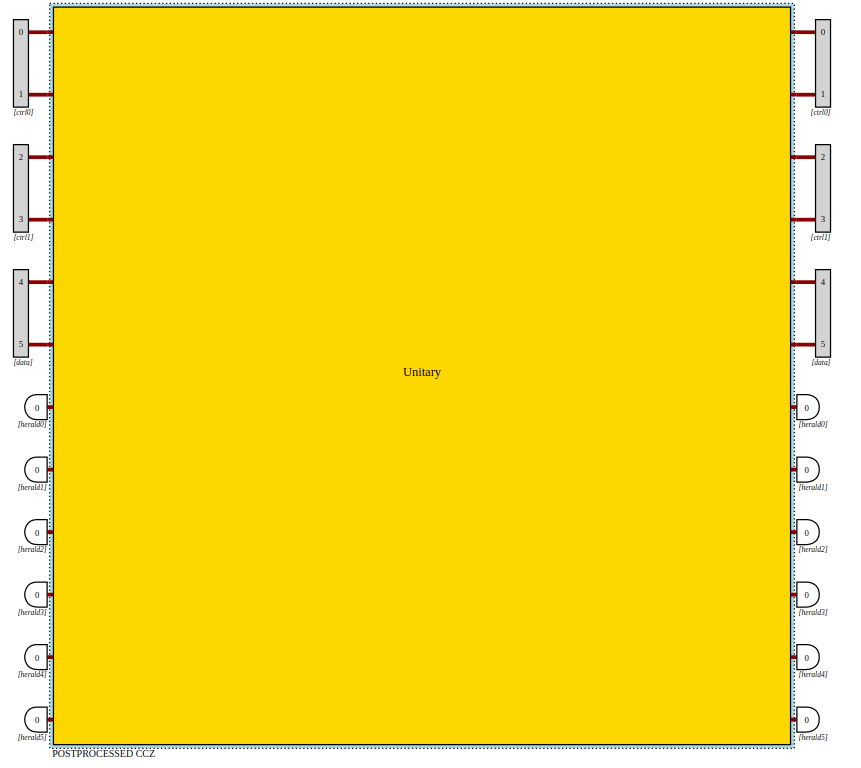

# FockCats
MIT iQuHACK 2024 - Quandela challenge

# Perceval Processor Generator

## Introduction
This script provides a Processor called `FockCats_CCZ` for quantum computing simulations.  We have also used an Advanced Optimization Algorithm called Genetic Algorithm optimize the function evaluate_matrix respect to m. Results are shown below.

## Usage
1. Install the required dependencies by running:

2. Run the script. It will define a Processor named FockCats_CCZ

4. Optionally, execute the generated processor for quantum computing simulations.

## Result
The script generates a Perceval Processor with specific configurations for quantum computing simulations.

Our optimization result seems not ideal, due to limited fidelity of ~0.99. This gives large penalties to the final performance so we decided to use the m matrix from Quandela's source code. However, Our optimization result is briefly included in thie README file, and the full process is included in our notebook.

#Jupyter Notebook is also provided that has the complete solution
2024_Quandela_Remote.ipynb is our main notebook
Bonus.ipynb is our attempt to the bonus part.

## Explanation
The provided code in `main.py` initializes a Perceval Processor with a specific quantum circuit configuration. The states and truth table are defined for the quantum algorithm analyzer. The script computes the results based on the truth table and displays the performance and fidelity of the quantum simulation.

# JupyterNotebook is also provided

## Optimize the function evaluate_matrix to m [6].

# The CCZ gate in the Preceval library - serves as the bottom line
|   | 000 | 010 | 100 | 110 | 001 | 011 | 101 | 111 |
|---|-----|-----|-----|-----|-----|-----|-----|-----|
| 000 | 1   | 0   | 0   | 0   | 0   | 0   | 0   | 0   |
| 010 | 0   | 1   | 0   | 0   | 0   | 0   | 0   | 0   |
| 100 | 0   | 0   | 1   | 0   | 0   | 0   | 0   | 0   |
| 110 | 0   | 0   | 0   | 0   | 0   | 0   | 0   | 1   |
| 001 | 0   | 0   | 0   | 0   | 1   | 0   | 0   | 0   |
| 011 | 0   | 0   | 0   | 0   | 0   | 1   | 0   | 0   |
| 101 | 0   | 0   | 0   | 0   | 0   | 0   | 1   | 0   |
| 111 | 0   | 0   | 0   | 1   | 0   | 0   | 0   | 0   |

# Optimization Algorithm: Genetic Algorithm

Generation 1: Best Fitness = -5625383.713208989, Performance = 0.02253562569531889, Fidelity = 0.4374616061434754

Generation 2: Best Fitness = -6348300.560057424, Performance = 0.0028710366240592075, Fidelity = 0.365169941123221

Generation 3: Best Fitness = -6426827.478040812, Performance = 0.003149953715482573, Fidelity = 0.3573172490459652

Generation 4: Best Fitness = -5577038.102341794, Performance = 0.00686650317965945, Fidelity = 0.4422961828993174

Generation 5: Best Fitness = -6030793.464021394, Performance = 0.003406469234104434, Fidelity = 0.39692065019139133

Generation 6: Best Fitness = -5854920.85362727, Performance = 0.009930664745347387, Fidelity = 0.41450790470660825

Generation 7: Best Fitness = -5800041.4034426315, Performance = 0.024286240123207743, Fidelity = 0.4199958353694967

Generation 8: Best Fitness = -4118242.5626295395, Performance = 0.07785045022128073, Fidelity = 0.5881756658865959

Generation 9: Best Fitness = -5069766.764668733, Performance = 0.019138995757125923, Fidelity = 0.493023304394131

Generation 10: Best Fitness = -4742439.575599578, Performance = 0.019394113706626002, Fidelity = 0.5257560230459285

Generation 11: Best Fitness = -4383916.321959608, Performance = 0.030845374386071274, Fidelity = 0.5616083369586647

Generation 12: Best Fitness = -4552959.859204714, Performance = 0.010041634777735139, Fidelity = 0.5447040040378939

Generation 13: Best Fitness = -5259991.8709433805, Performance = 0.011003369635178235, Fidelity = 0.4740008019022923

Generation 14: Best Fitness = -5359907.94618349, Performance = 0.021629048799051004, Fidelity = 0.46400918375260225

Generation 15: Best Fitness = -4444316.170467915, Performance = 0.024055283482673415, Fidelity = 0.555568358897925

Generation 16: Best Fitness = -3916446.847482679, Performance = 0.01627310913761353, Fidelity = 0.608355298978623

Generation 17: Best Fitness = -3434363.879538444, Performance = 0.02205675296733931, Fidelity = 0.6565635899894027

Generation 18: Best Fitness = -4174493.9471500427, Performance = 0.017816279935015177, Fidelity = 0.5825505874687158

Generation 19: Best Fitness = -3725505.7449260186, Performance = 0.019259226810017845, Fidelity = 0.6274494062481714

Generation 20: Best Fitness = -3865588.602044833, Performance = 0.060411119741218496, Fidelity = 0.613441079384397

Generation 21: Best Fitness = -4074113.1361825434, Performance = 0.02799334074524532, Fidelity = 0.5925886583884049

Generation 22: Best Fitness = -3124737.021182121, Performance = 0.044607865202171346, Fidelity = 0.6875262532739227

Generation 23: Best Fitness = -3170155.635419304, Performance = 0.04623846446940457, Fidelity = 0.6829843902196051

Generation 24: Best Fitness = -3063466.2655946244, Performance = 0.07841463265016063, Fidelity = 0.6936532950259049

Generation 25: Best Fitness = -3198505.701734594, Performance = 0.18439423178219133, Fidelity = 0.6801492454323088

Generation 26: Best Fitness = -3095145.196158309, Performance = 0.03581500096462681, Fidelity = 0.6904854445691682

Generation 27: Best Fitness = -3008854.434254174, Performance = 0.020491155804690134, Fidelity = 0.6991145360834268

Generation 28: Best Fitness = -3035901.7673146, Performance = 0.0219166035804126, Fidelity = 0.6964098013519364

Generation 29: Best Fitness = -2639228.1662403718, Performance = 0.1130986047950075, Fidelity = 0.736077070277358

Generation 30: Best Fitness = -2839030.638129659, Performance = 0.04992817982813317, Fidelity = 0.7160968862588543

Generation 31: Best Fitness = -2745288.4984245715, Performance = 0.18241890213984543, Fidelity = 0.7254709677386407

Generation 32: Best Fitness = -2757242.535626562, Performance = 0.19546193807246706, Fidelity = 0.7242755509754057

Generation 33: Best Fitness = -2803012.851382805, Performance = 0.2018194997388883, Fidelity = 0.7196985130422198

Generation 34: Best Fitness = -2846891.0655769124, Performance = 0.03454488546211291, Fidelity = 0.7153108588974233

Generation 35: Best Fitness = -2801226.764933373, Performance = 0.04014466195501418, Fidelity = 0.7198772833620007

Generation 36: Best Fitness = -2713350.445947511, Performance = 0.15141582475716112, Fidelity = 0.7286648039894241

Generation 37: Best Fitness = -2626303.470070634, Performance = 0.030218113635072985, Fidelity = 0.737369622774823

Generation 38: Best Fitness = -2624729.6647381126, Performance = 0.09490246209455305, Fidelity = 0.7375269386237266

Generation 39: Best Fitness = -2549262.884395878, Performance = 0.1649069461855199, Fidelity = 0.745073546653466

Generation 40: Best Fitness = -2580619.970196302, Performance = 0.1324864063705218, Fidelity = 0.7419378704939634

Generation 41: Best Fitness = -2565025.7081241943, Performance = 0.1542982403256621, Fidelity = 0.7434972748893403

Generation 42: Best Fitness = -2569933.5879712137, Performance = 0.13333053230594646, Fidelity = 0.7430065078723463

Generation 43: Best Fitness = -2568365.489558657, Performance = 0.19965770112160133, Fidelity = 0.7431632513864331

Generation 44: Best Fitness = -2613902.7574920584, Performance = 0.22972226729291773, Fidelity = 0.7386094945285269

Generation 45: Best Fitness = -2589276.5140660782, Performance = 0.17706052388275537, Fidelity = 0.7410721715328683

Generation 46: Best Fitness = -2604203.739211445, Performance = 0.10796541099704733, Fidelity = 0.7395795181134445

Generation 47: Best Fitness = -2556193.5788918305, Performance = 0.21255673925178742, Fidelity = 0.7443804295540777

Generation 48: Best Fitness = -2554418.6085775145, Performance = 0.19631349821641716, Fidelity = 0.7445579428287503

Generation 49: Best Fitness = -2594269.5011478523, Performance = 0.33682185307884466, Fidelity = 0.7405727130633617

Generation 50: Best Fitness = -2535284.354470196, Performance = 0.3198750810159163, Fidelity = 0.7464712446778994

Generation 51: Best Fitness = -2537456.1158873313, Performance = 0.12283465819384465, Fidelity = 0.7462542655766087

Generation 52: Best Fitness = -2541479.4441161337, Performance = 0.12463375416775545, Fidelity = 0.7458519309546324

Generation 53: Best Fitness = -2522554.626342115, Performance = 0.32438913735077235, Fidelity = 0.7477442129766512

Generation 54: Best Fitness = -2516570.2741823765, Performance = 0.31759185521604016, Fidelity = 0.7483426549899072

Generation 55: Best Fitness = -2519135.2828971623, Performance = 0.34638588378115587, Fidelity = 0.7480861253244

Generation 56: Best Fitness = -2547153.1483106967, Performance = 0.18951523562840356, Fidelity = 0.7452844956536947

Generation 57: Best Fitness = -2363254.7067114487, Performance = 0.018138237924953015, Fidelity = 0.7636745111906172

Generation 58: Best Fitness = -2528197.949993535, Performance = 0.3267992314407922, Fidelity = 0.7471798782014151

Generation 59: Best Fitness = -2515864.260999825, Performance = 0.2747121445912097, Fidelity = 0.7484132991878729

Generation 60: Best Fitness = -2523161.9949497366, Performance = 0.33280365705002657, Fidelity = 0.7476834677013693

Generation 61: Best Fitness = -2498166.3912876183, Performance = 0.020209443265371413, Fidelity = 0.7501833406617949

Generation 62: Best Fitness = -2517749.6070736395, Performance = 0.2586531003480943, Fidelity = 0.7482247806395357

Generation 63: Best Fitness = -2522499.0365897613, Performance = 0.20036107874384237, Fidelity = 0.7477498959799451

Generation 64: Best Fitness = -2528140.3185288124, Performance = 0.3620549009892876, Fidelity = 0.7471856060922177

Generation 65: Best Fitness = -2526722.4337988147, Performance = 0.36403918301743676, Fidelity = 0.7473273925809355

Generation 66: Best Fitness = -2529346.2122498555, Performance = 0.2983237455937449, Fidelity = 0.7470650804512688

Generation 67: Best Fitness = -2521792.447105863, Performance = 0.2706606639534964, Fidelity = 0.7478204846287497

Generation 68: Best Fitness = -2527061.9947144184, Performance = 0.26800632484227915, Fidelity = 0.7472935325222333

Generation 69: Best Fitness = -2525662.285326151, Performance = 0.4136950169296424, Fidelity = 0.747433357772368

Generation 70: Best Fitness = -2517833.7257547304, Performance = 0.5234818343231963, Fidelity = 0.7482161039426927

Generation 71: Best Fitness = -2521858.719399214, Performance = 0.22654465381986413, Fidelity = 0.7478139015154248

Generation 72: Best Fitness = -2533723.678917, Performance = 0.4345320191738495, Fidelity = 0.7466271975762808

Generation 73: Best Fitness = -2508035.5693758084, Performance = 0.2580367883475166, Fidelity = 0.7491961850256308

Generation 74: Best Fitness = -2518454.68211858, Performance = 0.2758566778419817, Fidelity = 0.7481542559314641

Generation 75: Best Fitness = -2515825.219113447, Performance = 0.2946838118979371, Fidelity = 0.7484171834048434

Generation 76: Best Fitness = -2499619.794498745, Performance = 0.12079152918847684, Fidelity = 0.7500378997585964

Generation 77: Best Fitness = -2473972.2935658153, Performance = 0.12034144195985184, Fidelity = 0.7526026503019765

Generation 78: Best Fitness = -2515263.396200184, Performance = 0.11811660591747046, Fidelity = 0.7484735422633757

Generation 79: Best Fitness = -2515441.0722243055, Performance = 0.1746493528978433, Fidelity = 0.7484557181282165

Generation 80: Best Fitness = -2509246.9800874917, Performance = 0.20231589268538636, Fidelity = 0.7490750996753581

Generation 81: Best Fitness = -2499366.92373634, Performance = 0.1444374431460932, Fidelity = 0.7500631631889229

Generation 82: Best Fitness = -2517613.503364915, Performance = 0.33906749996611674, Fidelity = 0.7482383105960085

Generation 83: Best Fitness = -2496755.5814208915, Performance = 0.10220181824387536, Fidelity = 0.7503243396560926

Generation 84: Best Fitness = -2501196.3740510033, Performance = 0.10558421197693238, Fidelity = 0.7498802570106877

Generation 85: Best Fitness = -2467726.246376361, Performance = 0.06814360887599022, Fidelity = 0.753227307218755

Generation 86: Best Fitness = -2489615.7814970855, Performance = 0.22414738434386394, Fidelity = 0.7510381977029071

Generation 87: Best Fitness = -2491445.3003304116, Performance = 0.19301025074976383, Fidelity = 0.7508552769567081

Generation 88: Best Fitness = -2507638.4029873875, Performance = 0.2149065825613714, Fidelity = 0.7492359447946787

Generation 89: Best Fitness = -2513146.9986370048, Performance = 0.4150214335357095, Fidelity = 0.748684885114866

Generation 90: Best Fitness = -2506452.8886971422, Performance = 0.3414098456338697, Fidelity = 0.7493543697204401

Generation 91: Best Fitness = -2508228.3475832865, Performance = 0.5349618615932912, Fidelity = 0.7491766302798097

Generation 92: Best Fitness = -2502573.5765416264, Performance = 0.42224759867190303, Fidelity = 0.7497422200982387

Generation 93: Best Fitness = -2505207.5873409836, Performance = 0.37890930976251885, Fidelity = 0.7494788623565919

Generation 94: Best Fitness = -2505000.441829067, Performance = 0.37977829201952157, Fidelity = 0.7494995760388012

Generation 95: Best Fitness = -2507821.8486811933, Performance = 0.44463135771846746, Fidelity = 0.749217370500523

Generation 96: Best Fitness = -2506662.1239400054, Performance = 0.41815815199419215, Fidelity = 0.7493333694478475

Generation 97: Best Fitness = -2506217.533450178, Performance = 0.4191008945687026, Fidelity = 0.7493778275540877

Generation 98: Best Fitness = -2504874.2612465983, Performance = 0.4238279330336011, Fidelity = 0.7495121500474071

Generation 99: Best Fitness = -2506828.0911868387, Performance = 0.3340164100482485, Fidelity = 0.7493168568649061

Generation 100: Best Fitness = -2506523.3244959335, Performance = 0.5116670737683715, Fidelity = 0.7493471558833329

Generation 101: Best Fitness = -2503597.0274902103, Performance = 0.46116487155082303, Fidelity = 0.7496398360861074

Generation 102: Best Fitness = -2502546.1943593435, Performance = 0.3736220663227922, Fidelity = 0.7497450069419993

Generation 103: Best Fitness = -2505301.8690779563, Performance = 0.5043493611285196, Fidelity = 0.7494693087428432

Generation 104: Best Fitness = -2505372.7308448763, Performance = 0.3095623958099052, Fidelity = 0.7494624173531166

Generation 105: Best Fitness = -2458929.680757169, Performance = 0.06809476547974587, Fidelity = 0.7541069638295176

Generation 106: Best Fitness = -2443821.6894593528, Performance = 0.058886398925219595, Fidelity = 0.7556177721676658

Generation 107: Best Fitness = -2495201.2661511395, Performance = 0.11983194253634004, Fidelity = 0.7504797535529435

Generation 108: Best Fitness = -2490581.7963504153, Performance = 0.1590099716938641, Fidelity = 0.7509416613549867

Generation 109: Best Fitness = -2409320.9117336073, Performance = 0.05409725761036321, Fidelity = 0.7590678547293817

Generation 110: Best Fitness = -2349095.176754944, Performance = 0.042367373285582884, Fidelity = 0.7650904399571323

Generation 111: Best Fitness = -2487018.6628529574, Performance = 0.13015324420516697, Fidelity = 0.75129800356146

Generation 112: Best Fitness = -2485356.8356598397, Performance = 0.1277516937960262, Fidelity = 0.7514641886823222

Generation 113: Best Fitness = -2505443.0227887565, Performance = 0.37262367607234115, Fidelity = 0.7494553250974483

Generation 114: Best Fitness = -2503449.4128679796, Performance = 0.6155470790605322, Fidelity = 0.749654443166123

Generation 115: Best Fitness = -2503430.753762313, Performance = 0.3929266691148112, Fidelity = 0.7496565316970996

Generation 116: Best Fitness = -2499270.490092388, Performance = 0.34202003773555134, Fidelity = 0.7500726089707235

Generation 117: Best Fitness = -2497104.48338066, Performance = 0.2946526974384231, Fidelity = 0.7502892570092365

Generation 118: Best Fitness = -2500389.2217304106, Performance = 0.29118731122861263, Fidelity = 0.7499607866396477

Generation 119: Best Fitness = -2504047.8142257007, Performance = 0.14173188943490828, Fidelity = 0.7495950768455405

Generation 120: Best Fitness = -2504681.8438742366, Performance = 0.28535408749273944, Fidelity = 0.7495315302584888

Generation 121: Best Fitness = -2501962.7050261158, Performance = 0.32855326549690983, Fidelity = 0.7498034009441229

Generation 122: Best Fitness = -2502232.66639753, Performance = 0.32165346278302076, Fidelity = 0.7497764117067842

Generation 123: Best Fitness = -2502260.9830597807, Performance = 0.33972427205003475, Fidelity = 0.7497735619697499

Generation 124: Best Fitness = -2505787.978722989, Performance = 0.41253170586544297, Fidelity = 0.7494207895959952

Generation 125: Best Fitness = -2501054.3586296802, Performance = 0.2392295374457909, Fidelity = 0.7498943249074945

Generation 126: Best Fitness = -2494374.9585014223, Performance = 0.21629096266347095, Fidelity = 0.7505622878588951

Generation 127: Best Fitness = -2504147.000592623, Performance = 0.39885183393785095, Fidelity = 0.7495849010889037

Generation 128: Best Fitness = -2505109.02570499, Performance = 0.20455255046202314, Fidelity = 0.7494888928769505

Generation 129: Best Fitness = -2504934.268106428, Performance = 0.47044087616592134, Fidelity = 0.7495061027484811

Generation 130: Best Fitness = -2504120.001795615, Performance = 0.22055181682370495, Fidelity = 0.7495877792686216

Generation 131: Best Fitness = -2491817.319906784, Performance = 0.04963552003290547, Fidelity = 0.7508182183738016

Generation 132: Best Fitness = -2476062.6537108067, Performance = 0.03488700756926028, Fidelity = 0.7523936997419117

Generation 133: Best Fitness = -2506193.087566307, Performance = 0.3086784207586247, Fidelity = 0.7493803825649485

Generation 134: Best Fitness = -2505431.53918798, Performance = 0.6001220859192812, Fidelity = 0.7494562459591161

Generation 135: Best Fitness = -2502446.5713282675, Performance = 0.41027757710955676, Fidelity = 0.7497549325895961

Generation 136: Best Fitness = -2505251.4868725813, Performance = 0.36488167226758506, Fidelity = 0.7494744864310696

Generation 137: Best Fitness = -2505199.560471747, Performance = 0.24708879118106128, Fidelity = 0.7494797968640341

Generation 138: Best Fitness = -2479757.38763929, Performance = 0.10861495544265103, Fidelity = 0.7520241526211155

Generation 139: Best Fitness = -2459821.6856805286, Performance = 0.12122913331204208, Fidelity = 0.7540177102028138

Generation 140: Best Fitness = -2474908.401206286, Performance = 0.20634967377770094, Fidelity = 0.7525089535296976

Generation 141: Best Fitness = -2456600.642107413, Performance = 0.14108231677287336, Fidelity = 0.7543397947069419

Generation 142: Best Fitness = -2485316.0726546436, Performance = 0.19717635595413618, Fidelity = 0.7514681955581797

Generation 143: Best Fitness = -2488811.0202909755, Performance = 0.20696947156598755, Fidelity = 0.7511186910014309

Generation 144: Best Fitness = -2471873.901908092, Performance = 0.09251553262798397, Fidelity = 0.7528125172936582

Generation 145: Best Fitness = -2463302.7369964994, Performance = 0.17580376737832026, Fidelity = 0.7536695504965827

Generation 146: Best Fitness = -2449169.7359164567, Performance = 0.16329190222174617, Fidelity = 0.7550828631164521

Generation 147: Best Fitness = -2447487.3093316546, Performance = 0.15057884991545098, Fidelity = 0.7552511184879847

Generation 148: Best Fitness = -2405008.375915959, Performance = 0.09359726986856429, Fidelity = 0.7594990688111343

Generation 149: Best Fitness = -2317176.940021863, Performance = 0.05333569808809937, Fidelity = 0.7682822526621156

Generation 150: Best Fitness = -2298400.803429333, Performance = 0.041797936271479735, Fidelity = 0.7701598778591304

Generation 151: Best Fitness = -2252492.4997259816, Performance = 0.041781510299979445, Fidelity = 0.7747507082458915

Generation 152: Best Fitness = -2248795.56233844, Performance = 0.04131047226520309, Fidelity = 0.7751204024556837

Generation 153: Best Fitness = -2200847.352835093, Performance = 0.05635223650737966, Fidelity = 0.7799152083642542

Generation 154: Best Fitness = -2092143.91824686, Performance = 0.01950353070961284, Fidelity = 0.7907855886717833

Generation 155: Best Fitness = -2058129.0057438028, Performance = 0.020489373542404314, Fidelity = 0.7941870789362462

Generation 156: Best Fitness = -2051168.503947513, Performance = 0.014438561745951728, Fidelity = 0.794883135166687

Generation 157: Best Fitness = -1664525.3610853974, Performance = 0.016913420520551805, Fidelity = 0.8335474469780397

Generation 158: Best Fitness = -1867831.6529369284, Performance = 0.010203158909820584, Fidelity = 0.8132168245031483

Generation 159: Best Fitness = -1751525.0144619145, Performance = 0.003935036496731593, Fidelity = 0.824847494618772

Generation 160: Best Fitness = -1746634.8843294755, Performance = 0.006719732890815303, Fidelity = 0.8253365048473196

Generation 161: Best Fitness = -1690039.9095170682, Performance = 0.013976742968938857, Fidelity = 0.8309959950715502

Generation 162: Best Fitness = -1295089.2405216873, Performance = 0.006444466976729435, Fidelity = 0.8704910695033643

Generation 163: Best Fitness = -1444453.698632703, Performance = 0.02791845899147083, Fidelity = 0.8555546022182707

Generation 164: Best Fitness = -1203991.0903236468, Performance = 0.012384599059353176, Fidelity = 0.8796008785830363

Generation 165: Best Fitness = -1078993.9445070561, Performance = 0.004887977584638763, Fidelity = 0.8921006006613168

Generation 166: Best Fitness = -1250428.7936216395, Performance = 0.009537519354678552, Fidelity = 0.8749571111003167

Generation 167: Best Fitness = -819118.0714487002, Performance = 0.008601830011502467, Fidelity = 0.9180881842533

Generation 168: Best Fitness = -645930.4368699933, Performance = 0.002294989785241569, Fidelity = 0.9354069540180109

Generation 169: Best Fitness = -523823.91407183424, Performance = 0.0021582515241658894, Fidelity = 0.947617606434565

Generation 170: Best Fitness = -903746.3145723669, Performance = 0.005956061966436127, Fidelity = 0.9096253625867013

Generation 171: Best Fitness = -699580.6117414457, Performance = 0.021459126168468106, Fidelity = 0.9300419173667293

Generation 172: Best Fitness = -635169.6656139133, Performance = 0.01775170926891931, Fidelity = 0.9364830156868994

Generation 173: Best Fitness = -507001.6457165511, Performance = 0.012255074891836987, Fidelity = 0.94929982317327

Generation 174: Best Fitness = -674031.5001850429, Performance = 0.016357142846013018, Fidelity = 0.9325968336243529

Generation 175: Best Fitness = -586562.2589100626, Performance = 0.016088232320644675, Fidelity = 0.9413437580207614

Generation 176: Best Fitness = -607763.1966200628, Performance = 0.005653818600974784, Fidelity = 0.9392236746841751

Generation 177: Best Fitness = -525149.7083605621, Performance = 0.01006640688641232, Fidelity = 0.9474850190975369

Generation 178: Best Fitness = -636354.4003607928, Performance = 0.018336117358402695, Fidelity = 0.9363645416278034

Generation 179: Best Fitness = -606165.7481705195, Performance = 0.013314902964971953, Fidelity = 0.9393834118680451

Generation 180: Best Fitness = -617285.1782105254, Performance = 0.003283578909043374, Fidelity = 0.9382714788953685

Generation 181: Best Fitness = -473998.41822291433, Performance = 0.007148445689378141, Fidelity = 0.9526001510292629

Generation 182: Best Fitness = -500977.24472207995, Performance = 0.011107413942387562, Fidelity = 0.9499022644203781

Generation 183: Best Fitness = -482004.0290859024, Performance = 0.011657279746366262, Fidelity = 0.95179958543413

Generation 184: Best Fitness = -365368.7250145294, Performance = 0.0033555100278584585, Fidelity = 0.963463124143037

Generation 185: Best Fitness = -321128.8107751497, Performance = 0.003396903098688637, Fidelity = 0.9678871155255819

Generation 186: Best Fitness = -319620.5017474025, Performance = 0.003343165353834905, Fidelity = 0.9680379464820944

Generation 187: Best Fitness = -314171.17834070476, Performance = 0.0027445000119867974, Fidelity = 0.9685828794214295

Generation 188: Best Fitness = -287574.81741468067, Performance = 0.00831400516942633, Fidelity = 0.9712425099445268

Generation 189: Best Fitness = -181645.47706191233, Performance = 0.012149532394278973, Fidelity = 0.9818354401442764

Generation 190: Best Fitness = -199043.9656570803, Performance = 0.008267014569904266, Fidelity = 0.9800955951672774

Generation 191: Best Fitness = -214603.12760705253, Performance = 0.0070002030885160955, Fidelity = 0.9785396802390917

Generation 192: Best Fitness = -199130.5511395259, Performance = 0.016027555277251398, Fidelity = 0.9800869288584921

Generation 193: Best Fitness = -235578.1209885498, Performance = 0.006395421313347806, Fidelity = 0.9764421815057237

Generation 194: Best Fitness = -176077.8604552065, Performance = 0.002837219744919903, Fidelity = 0.9823922111172596

Generation 195: Best Fitness = -210261.50312165247, Performance = 0.007556245309837289, Fidelity = 0.9789738421315894

Generation 196: Best Fitness = -179011.90120674623, Performance = 0.009001246271939179, Fidelity = 0.9820988008780791

Generation 197: Best Fitness = -147157.95191593896, Performance = 0.004046704570810863, Fidelity = 0.9852842007617015

Generation 198: Best Fitness = -176897.9157751971, Performance = 0.008099778069765471, Fidelity = 0.9823102003227022

Generation 199: Best Fitness = -157716.83043616856, Performance = 0.0073663083540582985, Fidelity = 0.9842283095900748

Generation 200: Best Fitness = -230478.2961753149, Performance = 0.006919734228478332, Fidelity = 0.9769521634627343

Generation 201: Best Fitness = -225648.98844958184, Performance = 0.012078127361865431, Fidelity = 0.9774350890769145

Generation 202: Best Fitness = -225325.26088520966, Performance = 0.006744447668074117, Fidelity = 0.9774674671670314

Generation 203: Best Fitness = -168447.45494446647, Performance = 0.005919356946483615, Fidelity = 0.9831552485861964

Generation 204: Best Fitness = -155397.8881250593, Performance = 0.00894481746060827, Fidelity = 0.9844602022426766

Generation 205: Best Fitness = -185008.52297469112, Performance = 0.013899439380251347, Fidelity = 0.9814991338030915

Generation 206: Best Fitness = -259219.0810162182, Performance = 0.013220372735430449, Fidelity = 0.9740780786780054

Generation 207: Best Fitness = -257587.51405057628, Performance = 0.012044144730126084, Fidelity = 0.9742412365507976

Generation 208: Best Fitness = -235336.17023401294, Performance = 0.019569752145317032, Fidelity = 0.9764663634068466

Generation 209: Best Fitness = -199810.67494803198, Performance = 0.029100408657511748, Fidelity = 0.9800189034047881

Generation 210: Best Fitness = -219942.50328716828, Performance = 0.02987058966413623, Fidelity = 0.9780057198006935

Generation 211: Best Fitness = -165861.3629763888, Performance = 0.007620320769950638, Fidelity = 0.9834138560820403

Generation 212: Best Fitness = -185639.51189892215, Performance = 0.02971560383110391, Fidelity = 0.981436019094504

Generation 213: Best Fitness = -158574.30880233186, Performance = 0.02461954505454423, Fidelity = 0.9841425445002218

Generation 214: Best Fitness = -175478.59655906056, Performance = 0.023324460078852888, Fidelity = 0.9824521170196339

Generation 215: Best Fitness = -171419.77100279662, Performance = 0.022339961088981536, Fidelity = 0.9828580005597592

Generation 216: Best Fitness = -177149.9788402103, Performance = 0.01687848777810386, Fidelity = 0.9822849852374912

Generation 217: Best Fitness = -166448.24898494, Performance = 0.015637391441191036, Fidelity = 0.9833551594641146

Generation 218: Best Fitness = -221810.36112719547, Performance = 0.01238476626563857, Fidelity = 0.9778189515025142

Generation 219: Best Fitness = -221832.0775082301, Performance = 0.012387382384523792, Fidelity = 0.9778167798617946

Generation 220: Best Fitness = -171359.0446925365, Performance = 0.020947033630784956, Fidelity = 0.9828640745837127

Generation 221: Best Fitness = -201767.35221030793, Performance = 0.00959709668548396, Fidelity = 0.9798232551818725

Generation 222: Best Fitness = -168662.8965960185, Performance = 0.003247266513274938, Fidelity = 0.9831337070931316

Generation 223: Best Fitness = -176357.09039995985, Performance = 0.01937530127324053, Fidelity = 0.9823642715847027

Generation 224: Best Fitness = -193540.03001351963, Performance = 0.014313084015887044, Fidelity = 0.980645982685564

Generation 225: Best Fitness = -198379.8853160845, Performance = 0.02497370932556034, Fidelity = 0.9801619864946822

Generation 226: Best Fitness = -160788.2170595078, Performance = 0.015019881765041184, Fidelity = 0.9839211632741675

Generation 227: Best Fitness = -179664.97089306833, Performance = 0.01535190611311733, Fidelity = 0.982033487558787

Generation 228: Best Fitness = -210984.88657431, Performance = 0.025610700477849687, Fidelity = 0.9789014857318685

Generation 229: Best Fitness = -201496.6973270896, Performance = 0.025162291883731213, Fidelity = 0.9798503051049992

Generation 230: Best Fitness = -231106.2979618741, Performance = 0.019691964034818175, Fidelity = 0.9768893505118486

Generation 231: Best Fitness = -153778.90015265174, Performance = 0.021407083614434764, Fidelity = 0.9846220885776512

Generation 232: Best Fitness = -153410.6303176138, Performance = 0.02140975023024603, Fidelity = 0.9846589155584884

Generation 233: Best Fitness = -153027.00940400967, Performance = 0.01894455383020556, Fidelity = 0.9846972801150452

Generation 234: Best Fitness = -167980.58265147207, Performance = 0.01749876269472507, Fidelity = 0.9832019242360901

Generation 235: Best Fitness = -198808.98558883477, Performance = 0.017524445727241694, Fidelity = 0.9801190839166708

Generation 236: Best Fitness = -184061.36033209495, Performance = 0.016511927949139537, Fidelity = 0.9815938474548626

Generation 237: Best Fitness = -177388.21116972098, Performance = 0.014902123553944692, Fidelity = 0.9822611639809044

Generation 238: Best Fitness = -157037.39954965754, Performance = 0.01902422643117911, Fidelity = 0.9842962410208078

Generation 239: Best Fitness = -194380.32853025338, Performance = 0.0179575867810117, Fidelity = 0.9805619491893879

Generation 240: Best Fitness = -209779.2635329612, Performance = 0.01434559734954331, Fidelity = 0.9790220593011065

Generation 241: Best Fitness = -183160.90678246567, Performance = 0.008353824420315013, Fidelity = 0.981683900967929

Generation 242: Best Fitness = -147401.01657917362, Performance = 0.012632006691664682, Fidelity = 0.9852598857100759

Generation 243: Best Fitness = -149396.14998644785, Performance = 0.0076510891339741476, Fidelity = 0.9850603773502661

Generation 244: Best Fitness = -198427.10359468844, Performance = 0.01203474729596844, Fidelity = 0.9801572776057839

Generation 245: Best Fitness = -134295.53743373347, Performance = 0.006062764123359896, Fidelity = 0.9865704401938625

Generation 246: Best Fitness = -186032.96691535055, Performance = 0.02219459914628519, Fidelity = 0.9813966811138658

Generation 247: Best Fitness = -178960.00816783597, Performance = 0.009861588389763897, Fidelity = 0.982103989321628

Generation 248: Best Fitness = -194498.6642768857, Performance = 0.016985333544637115, Fidelity = 0.9805501165869779

Generation 249: Best Fitness = -209691.84476237727, Performance = 0.01755754754730068, Fidelity = 0.9790307979662147

Generation 250: Best Fitness = -236202.86057572011, Performance = 0.009051539888270383, Fidelity = 0.9763797048908881

Generation 251: Best Fitness = -203239.2464155443, Performance = 0.023100174425514593, Fidelity = 0.9796760522582711

Generation 252: Best Fitness = -199937.271632766, Performance = 0.015801828986656878, Fidelity = 0.9800062570348944

Generation 253: Best Fitness = -148541.5518204078, Performance = 0.014036694170303458, Fidelity = 0.985145830781265

Generation 254: Best Fitness = -147012.81764973208, Performance = 0.025022059088286128, Fidelity = 0.9852986932129677

Generation 255: Best Fitness = -147859.02477516048, Performance = 0.023962291646542327, Fidelity = 0.9852140735601923

Generation 256: Best Fitness = -136330.65953723429, Performance = 0.019172707925822333, Fidelity = 0.9863669148735686

Generation 257: Best Fitness = -123412.08786029514, Performance = 0.018387280140187368, Fidelity = 0.9876587728266903

Generation 258: Best Fitness = -154159.01599094374, Performance = 0.02371756387753439, Fidelity = 0.9845840746833417

Generation 259: Best Fitness = -154289.9498783676, Performance = 0.018891609082981785, Fidelity = 0.9845709861205542

Generation 260: Best Fitness = -107113.40220951349, Performance = 0.026319954859785735, Fidelity = 0.9892886334590938

Generation 261: Best Fitness = -144391.68748381943, Performance = 0.019435487968041173, Fidelity = 0.9855608118161301

Generation 262: Best Fitness = -115803.06896837585, Performance = 0.024553900638482173, Fidelity = 0.9884196685492618

Generation 263: Best Fitness = -108540.52845330411, Performance = 0.01516901999336416, Fidelity = 0.9891459319856496

Generation 264: Best Fitness = -124027.41949995347, Performance = 0.017727760046243712, Fidelity = 0.9875972403222446

Generation 265: Best Fitness = -123237.15465789821, Performance = 0.017650899396246922, Fidelity = 0.9876762668833108

Generation 266: Best Fitness = -103495.33024188816, Performance = 0.015373987440167906, Fidelity = 0.9896504516018237

Generation 267: Best Fitness = -103889.5782515047, Performance = 0.015479936675144653, Fidelity = 0.9896110266949129

Generation 268: Best Fitness = -123007.4950015765, Performance = 0.019173870755701386, Fidelity = 0.9876992313259716

Generation 269: Best Fitness = -124676.0357771896, Performance = 0.021044174144257712, Fidelity = 0.9875323753781069

Generation 270: Best Fitness = -110141.3808716998, Performance = 0.01964689612940247, Fidelity = 0.9889858422659339

Generation 271: Best Fitness = -109998.09716034685, Performance = 0.019729224216659205, Fidelity = 0.9890001705547411

Generation 272: Best Fitness = -106149.33188868618, Performance = 0.020653203720291537, Fidelity = 0.9893850461579277

Generation 273: Best Fitness = -103858.1187557326, Performance = 0.02164238070901734, Fidelity = 0.989614166482046

Generation 274: Best Fitness = -120089.71887806356, Performance = 0.021721803807967316, Fidelity = 0.9879910063903898

Generation 275: Best Fitness = -109552.29383733815, Performance = 0.012362463960212376, Fidelity = 0.9890447582538022

Generation 276: Best Fitness = -137500.5656595493, Performance = 0.022360900940060636, Fidelity = 0.9862499210731441

Generation 277: Best Fitness = -131002.68500721209, Performance = 0.02599534565886575, Fidelity = 0.9868997055039331

Generation 278: Best Fitness = -172038.56226004518, Performance = 0.025419525365346366, Fidelity = 0.9827961183544701

Generation 279: Best Fitness = -143839.62140141288, Performance = 0.030633238582791517, Fidelity = 0.9856160072266201

Generation 280: Best Fitness = -139561.3993963836, Performance = 0.029460998349289908, Fidelity = 0.9860438305993633

Generation 281: Best Fitness = -136807.24455980625, Performance = 0.029848436994652675, Fidelity = 0.9863192456955824

Generation 282: Best Fitness = -130532.94315136923, Performance = 0.0227005220051289, Fidelity = 0.9869466829843411

Generation 283: Best Fitness = -160129.94482488002, Performance = 0.023698593249455484, Fidelity = 0.9839869818189187

Generation 284: Best Fitness = -132121.57274445306, Performance = 0.03176328427495581, Fidelity = 0.9867878109622704

Generation 285: Best Fitness = -108159.1252454149, Performance = 0.017947621180242054, Fidelity = 0.9891840695278373

Generation 286: Best Fitness = -136990.3349669693, Performance = 0.025229219883825236, Fidelity = 0.9863009412740832

Generation 287: Best Fitness = -129167.32377242012, Performance = 0.02089749716670846, Fidelity = 0.9870832467252608

Generation 288: Best Fitness = -134589.8523958661, Performance = 0.015064661015123328, Fidelity = 0.9865409996957524

Generation 289: Best Fitness = -119058.46550825845, Performance = 0.015412031077624535, Fidelity = 0.9880941380371431

Generation 290: Best Fitness = -123268.52086391526, Performance = 0.014006299987107496, Fidelity = 0.9876731339073085

Generation 291: Best Fitness = -121019.46748965797, Performance = 0.014084624699171489, Fidelity = 0.9878980391664095

Generation 292: Best Fitness = -95349.21749278036, Performance = 0.021312394426143088, Fidelity = 0.9904650569383275

Generation 293: Best Fitness = -109579.59145023124, Performance = 0.02355869271767229, Fidelity = 0.9890420172962842

Generation 294: Best Fitness = -127568.22106340839, Performance = 0.029594522653447034, Fidelity = 0.9872431482991365

Generation 295: Best Fitness = -114872.58540613117, Performance = 0.010241398444840977, Fidelity = 0.9885127312179884

Generation 296: Best Fitness = -103603.37613859553, Performance = 0.016206426330155958, Fidelity = 0.9896396461797141

Generation 297: Best Fitness = -87495.49586386609, Performance = 0.016552453428879933, Fidelity = 0.99125043386116

Generation 298: Best Fitness = -114095.1393682059, Performance = 0.009640299294432856, Fidelity = 0.9885904764228801

Generation 299: Best Fitness = -121104.02980150045, Performance = 0.019979136614824672, Fidelity = 0.9878895770407133

Generation 300: Best Fitness = -88607.7552786313, Performance = 0.008230867876170425, Fidelity = 0.991139216241269

Generation 301: Best Fitness = -113641.67453639714, Performance = 0.02554173434139032, Fidelity = 0.9886358070046259

Generation 302: Best Fitness = -103664.22345290617, Performance = 0.029459063410287305, Fidelity = 0.989633548195646

Generation 303: Best Fitness = -101441.39838356778, Performance = 0.02887832389043826, Fidelity = 0.9898558312833193

Generation 304: Best Fitness = -124611.04897975097, Performance = 0.030548740580509035, Fidelity = 0.9875388645532843

Generation 305: Best Fitness = -107166.33066520798, Performance = 0.01200545509591436, Fidelity = 0.9892833549280241

Generation 306: Best Fitness = -93202.347114457, Performance = 0.01157391850915562, Fidelity = 0.9906797537146358

Generation 307: Best Fitness = -109646.39477302517, Performance = 0.015378775487870085, Fidelity = 0.989035345143922

Generation 308: Best Fitness = -144275.22805490805, Performance = 0.02724159582094895, Fidelity = 0.9855724499529134

Generation 309: Best Fitness = -86883.90791953498, Performance = 0.02760790251458222, Fidelity = 0.991311581600144

Generation 310: Best Fitness = -114276.42008113662, Performance = 0.022531502194132358, Fidelity = 0.9885723354603841

Generation 311: Best Fitness = -101732.29401855209, Performance = 0.017208923800275173, Fidelity = 0.989826753389221

Generation 312: Best Fitness = -101758.73567290709, Performance = 0.016065492555133322, Fidelity = 0.9898241103672167

Generation 313: Best Fitness = -98814.76833325379, Performance = 0.01977236744058588, Fidelity = 0.9901185033943072

Generation 314: Best Fitness = -93743.501309801, Performance = 0.010552228637717216, Fidelity = 0.9906256393167913

Generation 315: Best Fitness = -124773.99204767027, Performance = 0.01886828166863422, Fidelity = 0.9875225819269513

Generation 316: Best Fitness = -78768.58031423019, Performance = 0.013552922559988566, Fidelity = 0.9921231284156544

Generation 317: Best Fitness = -78358.38855289623, Performance = 0.013171352765067595, Fidelity = 0.9921641479733576

Generation 318: Best Fitness = -102043.63284630261, Performance = 0.012843605286921717, Fidelity = 0.9897956238717645

Generation 319: Best Fitness = -86976.50828399757, Performance = 0.013015833338320721, Fidelity = 0.9913023361557669

Generation 320: Best Fitness = -63449.07823289351, Performance = 0.013541232787112488, Fidelity = 0.9936550786354779

Generation 321: Best Fitness = -101690.22433198821, Performance = 0.020431137797559704, Fidelity = 0.9898309571356634

Generation 322: Best Fitness = -126430.33530208032, Performance = 0.019753757168460524, Fidelity = 0.9873569467160348

Generation 323: Best Fitness = -100406.48297600892, Performance = 0.021635491824443853, Fidelity = 0.9899593300669073

Generation 324: Best Fitness = -99671.25106441193, Performance = 0.021640234898648573, Fidelity = 0.9900328532533239

Generation 325: Best Fitness = -99265.55396502522, Performance = 0.018860365193070425, Fidelity = 0.9900734257431323

Generation 326: Best Fitness = -87464.80760534055, Performance = 0.01743975855151932, Fidelity = 0.9912535017997074

Generation 327: Best Fitness = -105962.46388694963, Performance = 0.007909586518577637, Fidelity = 0.9894037457017185

Generation 328: Best Fitness = -111373.91528318128, Performance = 0.02082450393510308, Fidelity = 0.9888625876471779

Generation 329: Best Fitness = -108924.90453782135, Performance = 0.018075337247273452, Fidelity = 0.9891074914708806

Generation 330: Best Fitness = -106173.91018876637, Performance = 0.02568943687206721, Fidelity = 0.9893825832916865

Generation 331: Best Fitness = -84674.57059148802, Performance = 0.026136602165533564, Fidelity = 0.991532516804249

Generation 332: Best Fitness = -111750.8756060774, Performance = 0.03193722127040027, Fidelity = 0.988824880502171

Generation 333: Best Fitness = -91716.47624743474, Performance = 0.02490502421937358, Fidelity = 0.9908283274702323

Generation 334: Best Fitness = -82968.91975010229, Performance = 0.019248529808520078, Fidelity = 0.99170308877646

Generation 335: Best Fitness = -92188.84700092381, Performance = 0.025259284305357496, Fidelity = 0.9907810900406233

Generation 336: Best Fitness = -87041.14082961365, Performance = 0.03321787498604686, Fidelity = 0.9912958526991636

Generation 337: Best Fitness = -104224.83292368673, Performance = 0.01929439535314098, Fidelity = 0.989577497413236

Generation 338: Best Fitness = -86433.49449975962, Performance = 0.018002524422616163, Fidelity = 0.9913566325474996

Generation 339: Best Fitness = -59744.289362269155, Performance = 0.014262214954263991, Fidelity = 0.9940255568015581

Generation 340: Best Fitness = -49481.14338132299, Performance = 0.014457640589442192, Fidelity = 0.9950518712042271

Generation 341: Best Fitness = -64542.19392443842, Performance = 0.01586716391241292, Fidelity = 0.9935457647403922

Generation 342: Best Fitness = -48548.41865923589, Performance = 0.015552022411797971, Fidelity = 0.995145142582054

Generation 343: Best Fitness = -101380.53316719165, Performance = 0.020390640475517485, Fidelity = 0.9898619262926404

Generation 344: Best Fitness = -85679.05196150826, Performance = 0.02027699062063279, Fidelity = 0.9914320745268586

Generation 345: Best Fitness = -93900.71823336776, Performance = 0.019291498132948642, Fidelity = 0.9906099088851651

Generation 346: Best Fitness = -95443.42293002014, Performance = 0.0205597311769333, Fidelity = 0.9904556371472668

Generation 347: Best Fitness = -77365.69547743653, Performance = 0.01420230117090121, Fidelity = 0.9922634162499552

Generation 348: Best Fitness = -91623.23999901315, Performance = 0.02732285923916613, Fidelity = 0.9908376486772394

Generation 349: Best Fitness = -108743.87288397682, Performance = 0.02529433512539707, Fidelity = 0.9891255874172672

Generation 350: Best Fitness = -99249.60573010046, Performance = 0.027235735466029122, Fidelity = 0.9900750121912545

Generation 351: Best Fitness = -101932.10232393348, Performance = 0.02291694727168725, Fidelity = 0.9898067668506594

Generation 352: Best Fitness = -101452.95942938095, Performance = 0.027855462845633595, Fidelity = 0.9898546762015991

Generation 353: Best Fitness = -90965.37471270589, Performance = 0.02923710507479629, Fidelity = 0.9909034332916243

Generation 354: Best Fitness = -84213.41020458737, Performance = 0.025505708358199323, Fidelity = 0.9915786334738329

Generation 355: Best Fitness = -108757.9290601096, Performance = 0.019644650539856007, Fidelity = 0.9891241874493385

Generation 356: Best Fitness = -100719.01068248737, Performance = 0.024468306156470783, Fidelity = 0.9899280744634451

Generation 357: Best Fitness = -83581.46893913217, Performance = 0.028667023215041897, Fidelity = 0.9916418244390636

Generation 358: Best Fitness = -89849.51254696706, Performance = 0.022884697991506095, Fidelity = 0.9910150258606053

Generation 359: Best Fitness = -105827.19014976331, Performance = 0.02536518238464335, Fidelity = 0.9894172556198413

Generation 360: Best Fitness = -126866.57641812364, Performance = 0.018276688115151346, Fidelity = 0.9873133240814995

Generation 361: Best Fitness = -113824.68599248328, Performance = 0.02496970149649004, Fidelity = 0.9886175064310502

Generation 362: Best Fitness = -98081.8539028259, Performance = 0.025537547650535185, Fidelity = 0.9901917890721698

Generation 363: Best Fitness = -106496.24925255311, Performance = 0.03234810577948402, Fidelity = 0.9893503427266389

Generation 364: Best Fitness = -84644.72829342149, Performance = 0.025582579390720762, Fidelity = 0.9915355015880785

Generation 365: Best Fitness = -87108.09765295731, Performance = 0.01418248493506457, Fidelity = 0.9912891760522193

Generation 366: Best Fitness = -80100.31493299472, Performance = 0.02966798608040526, Fidelity = 0.9919899388387144

Generation 367: Best Fitness = -88557.36716416714, Performance = 0.028405532919488965, Fidelity = 0.9911442348780504

Generation 368: Best Fitness = -70347.01419315484, Performance = 0.02512320575726267, Fidelity = 0.9929652734574788

Generation 369: Best Fitness = -78265.85517601225, Performance = 0.025007101789584908, Fidelity = 0.992173389475297

Generation 370: Best Fitness = -65329.46589354321, Performance = 0.01993366206066223, Fidelity = 0.9934670334769836

Generation 371: Best Fitness = -77107.739793692, Performance = 0.022703745495487013, Fidelity = 0.9922892033168853

Generation 372: Best Fitness = -61227.63294224421, Performance = 0.023925861436121392, Fidelity = 0.9938772127799141

Generation 373: Best Fitness = -73317.64791530746, Performance = 0.015202428318157813, Fidelity = 0.9926682200060409

Generation 374: Best Fitness = -55689.95754451337, Performance = 0.016329578819855934, Fidelity = 0.9944309879159698

Generation 375: Best Fitness = -60196.311790904954, Performance = 0.022891105283637962, Fidelity = 0.9939803459298042

Generation 376: Best Fitness = -58155.29963466432, Performance = 0.022320126440712282, Fidelity = 0.9941844477164071

Generation 377: Best Fitness = -67877.74333569975, Performance = 0.023605486064023195, Fidelity = 0.993212202060944

Generation 378: Best Fitness = -48819.42706649201, Performance = 0.021379167890945773, Fidelity = 0.9951180359141829

Generation 379: Best Fitness = -48819.42706649201, Performance = 0.021379167890945773, Fidelity = 0.9951180359141829

Generation 380: Best Fitness = -57241.83574069215, Performance = 0.021367339579442753, Fidelity = 0.9942757950585912

Generation 381: Best Fitness = -54175.08967227385, Performance = 0.02044395395836239, Fidelity = 0.9945824705888187

Generation 382: Best Fitness = -55243.51395174963, Performance = 0.02062997391994455, Fidelity = 0.9944756279748511

Generation 383: Best Fitness = -75026.18811886357, Performance = 0.01798640719275352, Fidelity = 0.9924973632017065

Generation 384: Best Fitness = -65219.197722992525, Performance = 0.01877490914180719, Fidelity = 0.9934780614527916

Generation 385: Best Fitness = -68333.03409493974, Performance = 0.019384407500896417, Fidelity = 0.9931666772060985

Generation 386: Best Fitness = -55812.117311640686, Performance = 0.016897595691292105, Fidelity = 0.9944187713712402

Generation 387: Best Fitness = -70877.76945932987, Performance = 0.01999998578133972, Fidelity = 0.9929122030540812

Generation 388: Best Fitness = -70230.48793721659, Performance = 0.021829640612810893, Fidelity = 0.9929769293766377

Generation 389: Best Fitness = -73129.85399540619, Performance = 0.019348430079680214, Fidelity = 0.9926869952520293

Generation 390: Best Fitness = -65138.79236991846, Performance = 0.012120804273592058, Fidelity = 0.9934861086422039

Generation 391: Best Fitness = -62261.838626971556, Performance = 0.012136130632556872, Fidelity = 0.9937738040011722

Generation 392: Best Fitness = -63023.11010230443, Performance = 0.011878407857906493, Fidelity = 0.9936976771113617

Generation 393: Best Fitness = -59737.37932371801, Performance = 0.01344354413607461, Fidelity = 0.9940262486240841

Generation 394: Best Fitness = -51389.01573777299, Performance = 0.014823948490900794, Fidelity = 0.9948610836022742

Generation 395: Best Fitness = -81356.75416118918, Performance = 0.01572678843484798, Fidelity = 0.9918643088570926

Generation 396: Best Fitness = -78312.80279123005, Performance = 0.02979465767943424, Fidelity = 0.9921686899262193

Generation 397: Best Fitness = -73450.53419303271, Performance = 0.027069612529641605, Fidelity = 0.9926549195110842

Generation 398: Best Fitness = -82271.26029282424, Performance = 0.019430400636942867, Fidelity = 0.9917728545403169

Generation 399: Best Fitness = -95962.52941315391, Performance = 0.0233515334794301, Fidelity = 0.9904037237071511

Generation 400: Best Fitness = -69539.25630146789, Performance = 0.019429007908353613, Fidelity = 0.9930460549408453

Generation 401: Best Fitness = -78765.8410815368, Performance = 0.02242803370022169, Fidelity = 0.9921233934638126

Generation 402: Best Fitness = -86823.75299676285, Performance = 0.02554681790156351, Fidelity = 0.9913175991535058

Generation 403: Best Fitness = -84573.3809896169, Performance = 0.016712868497539436, Fidelity = 0.9915426451881698

Generation 404: Best Fitness = -70566.34935431363, Performance = 0.012779402467588484, Fidelity = 0.9929433522851662

Generation 405: Best Fitness = -68620.80662414295, Performance = 0.024007202157826694, Fidelity = 0.9931378953303835

Generation 406: Best Fitness = -66359.54099124635, Performance = 0.019084678410114925, Fidelity = 0.993364026816197

Generation 407: Best Fitness = -87626.77697011294, Performance = 0.02333670749503997, Fidelity = 0.9912372989662812

Generation 408: Best Fitness = -72467.90478044437, Performance = 0.023303960874213322, Fidelity = 0.9927531862179947

Generation 409: Best Fitness = -73095.1163528677, Performance = 0.020877245753823943, Fidelity = 0.9926904674874675

Generation 410: Best Fitness = -89322.36948969189, Performance = 0.015714068131932754, Fidelity = 0.9910677473369627

Generation 411: Best Fitness = -85667.50740563516, Performance = 0.02239599766327956, Fidelity = 0.9914332268634388

Generation 412: Best Fitness = -82357.61337782285, Performance = 0.0242132498190759, Fidelity = 0.9917642144489679

Generation 413: Best Fitness = -87389.3883248352, Performance = 0.018804831837229745, Fidelity = 0.9912610423626846

Generation 414: Best Fitness = -74159.15571176544, Performance = 0.02201510912555417, Fidelity = 0.9925840624137143

Generation 415: Best Fitness = -68333.82196834311, Performance = 0.021716878143949025, Fidelity = 0.9931665960862875

Generation 416: Best Fitness = -72921.71173244376, Performance = 0.018931760771124, Fidelity = 0.9927078098949949

Generation 417: Best Fitness = -62023.82138950943, Performance = 0.025962613639159728, Fidelity = 0.9937975918984354

Generation 418: Best Fitness = -71045.62884759478, Performance = 0.018860146768094086, Fidelity = 0.9928954182550938

Generation 419: Best Fitness = -80487.75151570342, Performance = 0.018046372039796307, Fidelity = 0.9919512068020576

Generation 420: Best Fitness = -83046.42670692058, Performance = 0.018614190217993525, Fidelity = 0.9916953387151177

Generation 421: Best Fitness = -92389.4018912035, Performance = 0.030667192850407376, Fidelity = 0.9907610291436868

Generation 422: Best Fitness = -93379.82987690374, Performance = 0.020204641538145367, Fidelity = 0.9906619968076681

Generation 423: Best Fitness = -101594.15744679101, Performance = 0.03647760010779904, Fidelity = 0.9898405477777208

Generation 424: Best Fitness = -98217.83242457468, Performance = 0.019685022560328613, Fidelity = 0.99017819707252

Generation 425: Best Fitness = -81700.72329844939, Performance = 0.027475340853367385, Fidelity = 0.9918299001948142

Generation 426: Best Fitness = -83811.47222602773, Performance = 0.020683984498785876, Fidelity = 0.9916188320934127

Generation 427: Best Fitness = -69501.71049455571, Performance = 0.03276193120876217, Fidelity = 0.9930497961886132

Generation 428: Best Fitness = -68128.28828653907, Performance = 0.01986925441733901, Fidelity = 0.9931871513020917

Generation 429: Best Fitness = -83706.98738996524, Performance = 0.030923168596860937, Fidelity = 0.9916292703378349

Generation 430: Best Fitness = -57966.75840888856, Performance = 0.017478736544662497, Fidelity = 0.9942033066803746

Generation 431: Best Fitness = -66737.50414205568, Performance = 0.018024642802712695, Fidelity = 0.9933262315611516

Generation 432: Best Fitness = -61358.327635403366, Performance = 0.021200203383796083, Fidelity = 0.9938641460362563

Generation 433: Best Fitness = -80798.65958969889, Performance = 0.021949807449262004, Fidelity = 0.9919201120912227

Generation 434: Best Fitness = -74774.72353369667, Performance = 0.015298196194965771, Fidelity = 0.9925225123484341

Generation 435: Best Fitness = -66066.435884501, Performance = 0.02231901174004761, Fidelity = 0.9933933340925382

Generation 436: Best Fitness = -84500.29172763228, Performance = 0.025394685622040208, Fidelity = 0.9915499454325511

Generation 437: Best Fitness = -81658.81676561853, Performance = 0.018060220093092286, Fidelity = 0.991834100263218

Generation 438: Best Fitness = -88954.87918658483, Performance = 0.018369760691496404, Fidelity = 0.9911044937115808

Generation 439: Best Fitness = -78009.90251119086, Performance = 0.014513143623850361, Fidelity = 0.9921989952357373

Generation 440: Best Fitness = -87883.60807239915, Performance = 0.013904003581535427, Fidelity = 0.9912116252887565

Generation 441: Best Fitness = -75095.40308381573, Performance = 0.007087465509771505, Fidelity = 0.9924904526041529

Generation 442: Best Fitness = -89185.75410553075, Performance = 0.018688555481001023, Fidelity = 0.9910814059008914

Generation 443: Best Fitness = -84198.12821131904, Performance = 0.007959193201241981, Fidelity = 0.9915801792196749

Generation 444: Best Fitness = -65080.92618005474, Performance = 0.02144268870731706, Fidelity = 0.9934918859393058

Generation 445: Best Fitness = -77282.09929176758, Performance = 0.018282380628372546, Fidelity = 0.9922717717884426

Generation 446: Best Fitness = -90052.14938667942, Performance = 0.012406390987827972, Fidelity = 0.9909947726549411

Generation 447: Best Fitness = -83498.9758507975, Performance = 0.018604756964685464, Fidelity = 0.9916500838101633

Generation 448: Best Fitness = -82149.79905151008, Performance = 0.024336072890766287, Fidelity = 0.9917849957587761

Generation 449: Best Fitness = -53717.71546096886, Performance = 0.020967766552641397, Fidelity = 0.9946282074861366

Generation 450: Best Fitness = -56635.76384226322, Performance = 0.02291634337769111, Fidelity = 0.9943364006994303

Generation 451: Best Fitness = -73503.09396968856, Performance = 0.022050159853637136, Fidelity = 0.9926496685528713

Generation 452: Best Fitness = -72501.72168230335, Performance = 0.017289679671224453, Fidelity = 0.99274981054209

Generation 453: Best Fitness = -80125.83243826401, Performance = 0.025815053947826086, Fidelity = 0.9919873909411197

Generation 454: Best Fitness = -41978.886937788404, Performance = 0.00785347238303116, Fidelity = 0.9958021034527488

Generation 455: Best Fitness = -68035.78545028564, Performance = 0.029696478046162773, Fidelity = 0.9931963917584934

Generation 456: Best Fitness = -75614.37399977368, Performance = 0.020934288879599253, Fidelity = 0.9924385416657338

Generation 457: Best Fitness = -61113.53649372033, Performance = 0.022154236732804627, Fidelity = 0.9938886241963912

Generation 458: Best Fitness = -68673.7317377523, Performance = 0.025828004675998124, Fidelity = 0.9931326009982201

Generation 459: Best Fitness = -62541.784143639, Performance = 0.025339316010009372, Fidelity = 0.9937457962463201

Generation 460: Best Fitness = -62988.598653141606, Performance = 0.01820386234507338, Fidelity = 0.9937011219308235

Generation 461: Best Fitness = -59435.88866493333, Performance = 0.026375734196054438, Fidelity = 0.9940563847577725

Generation 462: Best Fitness = -52129.61837127543, Performance = 0.015582652231210897, Fidelity = 0.9947870225802202

Generation 463: Best Fitness = -57061.407212961545, Performance = 0.01548836459590709, Fidelity = 0.9942938437903392

Generation 464: Best Fitness = -57270.50201600577, Performance = 0.025531493035298336, Fidelity = 0.9942729242669064

Generation 465: Best Fitness = -64160.51899428261, Performance = 0.02392641853915414, Fidelity = 0.9935839241741532

Generation 466: Best Fitness = -64011.17944911749, Performance = 0.023880287270690987, Fidelity = 0.993598858174801

Generation 467: Best Fitness = -79252.73636100168, Performance = 0.017156169278343243, Fidelity = 0.9920747092077306

Generation 468: Best Fitness = -61909.54227838356, Performance = 0.02336160928751461, Fidelity = 0.9938090224105524

Generation 469: Best Fitness = -64745.81379683116, Performance = 0.024419793779733204, Fidelity = 0.9935253942005231

Generation 470: Best Fitness = -76434.82274269173, Performance = 0.020707143191247026, Fidelity = 0.9923564970185876

Generation 471: Best Fitness = -81205.99954000968, Performance = 0.01876879005039608, Fidelity = 0.991879381277209

Generation 472: Best Fitness = -77607.51380067733, Performance = 0.005543414703754496, Fidelity = 0.9922392430765176

Generation 473: Best Fitness = -74074.89884334199, Performance = 0.023173033444821522, Fidelity = 0.9925924869426324

Generation 474: Best Fitness = -67289.00486366439, Performance = 0.023176015541352825, Fidelity = 0.993271076337618

Generation 475: Best Fitness = -73343.3937415207, Performance = 0.023991498449715213, Fidelity = 0.9926656366343495

Generation 476: Best Fitness = -71202.20062512114, Performance = 0.02468784455006312, Fidelity = 0.9928797552496433

Generation 477: Best Fitness = -69188.32783589028, Performance = 0.024370592696228394, Fidelity = 0.9930811428458183

Generation 478: Best Fitness = -70065.41318852843, Performance = 0.019750459901639525, Fidelity = 0.9929934389306873

Generation 479: Best Fitness = -60014.68329275782, Performance = 0.015917519358978015, Fidelity = 0.9939985157532049

Generation 480: Best Fitness = -67776.19000118083, Performance = 0.01825549389642785, Fidelity = 0.993222362744388
Generation 481: Best Fitness = -63871.4239196225, Performance = 0.02029890400431778, Fidelity = 0.9936128373091337

Generation 482: Best Fitness = -80605.32201595439, Performance = 0.013419691113261965, Fidelity = 0.9919394543787134

Generation 483: Best Fitness = -71910.39114047687, Performance = 0.021630309138342824, Fidelity = 0.9928089392556432

Generation 484: Best Fitness = -81456.33550473757, Performance = 0.02105626568285453, Fidelity = 0.9918543453932606

Generation 485: Best Fitness = -66062.95105301002, Performance = 0.022153297501456223, Fidelity = 0.9933936827414015

Generation 486: Best Fitness = -62208.46154053462, Performance = 0.013901984152101525, Fidelity = 0.9937791399439624

Generation 487: Best Fitness = -93056.78786414213, Performance = 0.02318878121214078, Fidelity = 0.9906942980248046

Generation 488: Best Fitness = -65070.53408058544, Performance = 0.020552777396193083, Fidelity = 0.9934929260391641

Generation 489: Best Fitness = -77824.17900207665, Performance = 0.02309941089248849, Fidelity = 0.9922175590003814

Generation 490: Best Fitness = -68464.39411340079, Performance = 0.021971154704315033, Fidelity = 0.9931535386175052

Generation 491: Best Fitness = -77120.79815424637, Performance = 0.026308709451344645, Fidelity = 0.9922878938758659

Generation 492: Best Fitness = -60882.19893124401, Performance = 0.014892896317044678, Fidelity = 0.9939117652139793

Generation 493: Best Fitness = -56869.439790122524, Performance = 0.021698666759860763, Fidelity = 0.994313034322321

Generation 494: Best Fitness = -61203.190455059215, Performance = 0.02547877197725297, Fidelity = 0.9938796554757221

Generation 495: Best Fitness = -66239.79374841416, Performance = 0.024366515772262273, Fidelity = 0.9933759962586428

Generation 496: Best Fitness = -85600.96847228693, Performance = 0.025388852132111714, Fidelity = 0.9914398777639192

Generation 497: Best Fitness = -68334.0683930039, Performance = 0.023528318907554902, Fidelity = 0.9931665696323807

Generation 498: Best Fitness = -58815.24945400344, Performance = 0.016799529708291624, Fidelity = 0.99411845825507

Generation 499: Best Fitness = -65362.314897503085, Performance = 0.025698937691037933, Fidelity = 0.993463742811312

Generation 500: Best Fitness = -87431.90349724784, Performance = 0.02116837397503439, Fidelity = 0.9912567884819012

# Optimized Paramters
(array([[ 25.59049385,  -5.43796247,   3.60220135,  -2.40719708,
           3.82261704,  -8.37856576,  -0.21988188,   0.34130629,
           7.40783522],
        [  0.34693688,   5.63847369,   0.19685201,   9.41510656,
          -0.77739962,  -1.47032505,   0.34632738,  -5.3162834 ,
           1.55616257],
        [  0.85626519,  -0.07800748, -23.24934382,  -0.25318446,
           0.54265673, -11.42453276,  -2.76392074,  -6.02731853,
          -4.368726  ],
        [ -0.09047742,   5.67560055,   0.93608411,  -8.49087582,
          -4.56440212,  -7.52664516,  11.74023344,   0.47133831,
           9.37925092],
        [ -0.12506459,   4.75008462,   0.51306787,  -2.0660361 ,
          17.88204994,   1.7062149 ,  -5.61387328,  -4.58454737,
          -3.89978063],
        [ -0.7570048 ,  -1.53704519,  -1.00958121,  -4.42569784,
           0.84685873,   9.15241854,   6.29298551,   0.60037314,
          -1.61808421],
        [ -1.9718201 ,   1.03703778,  -0.6173608 ,   3.6286028 ,
           1.0211494 ,  -0.75131325,   2.4334466 ,   5.95631139,
           1.83162979],
        [ -2.54303233,   1.17674655,  -1.30149818,   2.39653929,
           1.25288363,  -0.02904379,  -7.39596759,  -3.03427505,
          -1.24747347],
        [ -0.4945556 ,   1.92450574,   0.91236717,  -0.52830935,
          -0.30063787,   2.44415197,   4.62051341,  -1.92538217,
           2.5499258 ]]),
 -87431.90349724784)

 # References
[1] Aaronson, S., & Arkhipov, A. (2011, June). The computational complexity of linear optics. In Proceedings of the forty-third annual ACM symposium on Theory of computing (pp. 333-342).

[2] Reck, M., Zeilinger, A., Bernstein, H. J., & Bertani, P. (1994). Experimental realization of any discrete unitary operator. Physical review letters, 73(1), 58.

[3] Clements, W. R., Humphreys, P. C., Metcalf, B. J., Kolthammer, W. S., & Walmsley, I. A. (2016). Optimal design for universal multiport interferometers. Optica, 3(12), 1460-1465.

[4] Knill, E., Laflamme, R., & Milburn, G. J. (2001). A scheme for efficient quantum computation with linear optics. nature, 409(6816), 46-52.

[5] Knill, E. (2002). Quantum gates using linear optics and postselection. Physical Review A, 66(5), 052306.

[6] Uskov, D. B., Kaplan, L., Smith, A. M., Huver, S. D., & Dowling, J. P. (2009). Maximal success probabilities of linear-optical quantum gates. Physical Review A, 79(4), 042326.

